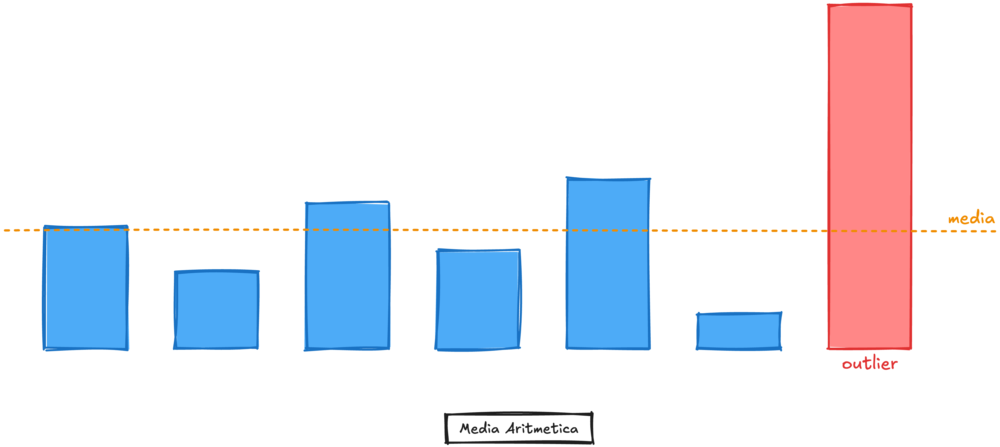
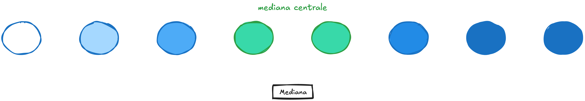
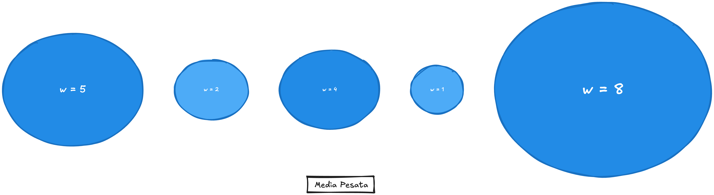
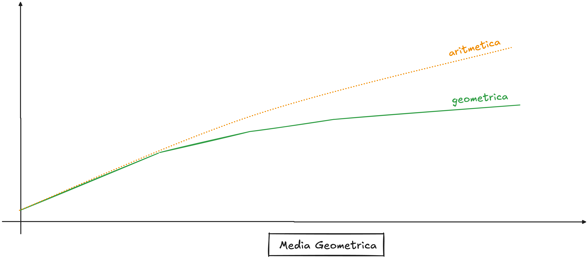
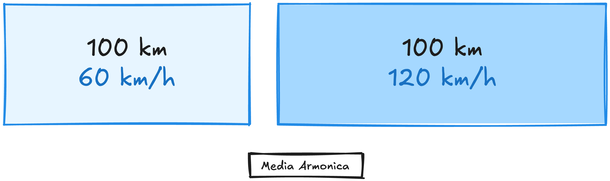
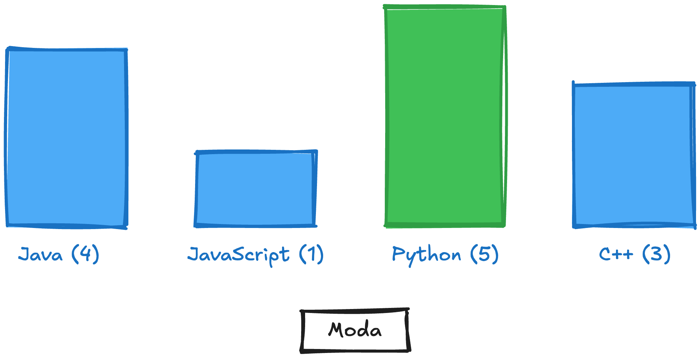
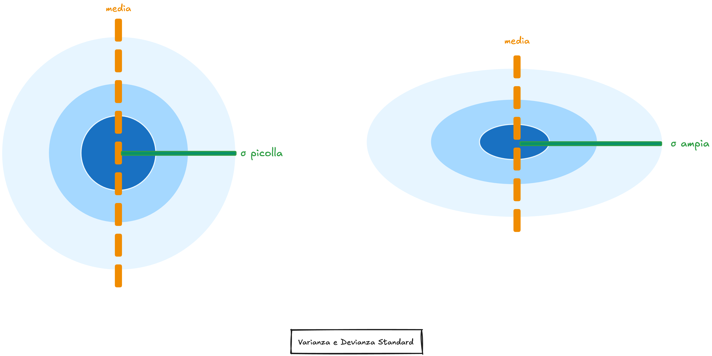
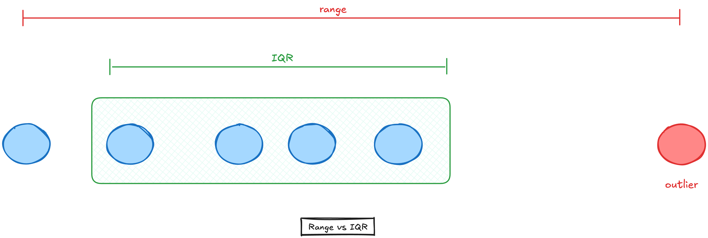

# 02 - Statistica descrittiva

> Fonte Notion: https://app.notion.com/p/32f12abc808d8185b36ff5b3faabe965 — ultima modifica 2026-04-14T14:19:54.504Z

<table_of_contents color="gray"/>
La **statistica descrittiva** sintetizza e descrive un dataset **prima** di qualsiasi modello. Capire come si distribuiscono i dati è il passo zero di ogni analisi, non basta calcolare una media perchè dataset diversi richiedono misure diverse. 
- **Misure di tendenza centrale:** sintetizzano il dataset in un valore rappresentativo (media, mediana, moda...)
- **Misure di dispersione:** descrivono quanto i dati si allontanano dal centro (varianza, deviazione standard, IQR...)
---
## Misure di tendenza centrale
Prendiamo questo dataset come filo conduttore: **stipendi di 42 dipendenti**, con un CEO che guadagna €500K.
```python
salaries = [1200, 1280, 1300, ..., 80000, 80000, 500000]
```
---
### Media aritmetica
$`\bar{x} = \frac{\sum_{i=1}^{n} x_i}{n}`$
$`\bar{x}`$ ("x barra") è la **media**, il simbolo $`\sum`$ significa "*somma tutto*". Quindi: somma tutti i valori e dividi per $`n`$ (quanti sono). La somma di tutti i valori divisa per il numero di osservazioni. 

> ⚠️ **Problema con gli outlier:** il CEO da €500K trascina la media a €22.486K. Nessun dipendente "*medio*" guadagna quella cifra, è un numero che non rappresenta nessuno.
```python
import statistics
import numpy as np

print(statistics.mean(salaries))   # 22486 — distorta
print(np.mean(salaries))           # 22486 — identico: np.mean è equivalente su liste Python
# np.mean diventa preferibile su array numpy di grandi dimensioni (più veloce)
```
**`argsort()`**** per trovare gli outlier per nome**
Quando hai due array allineati (valori + etichette), `argsort()` restituisce gli **indici** che ordinerebbero l'array — non i valori. Questo permette di estrarre sia il valore che l'etichetta corrispondente:
```python
expenses  = np.array([7.5,    90.8,       10.0,       3.95       ])
categories = np.array(["BANCA", "TRASPORTO", "BANCA", "FOOD & DRINK"])

# argsort() → [3, 0, 2, 1]  (indici che ordinerebbero in modo crescente)
# [::-1]    → [1, 2, 0, 3]  (invertito = decrescente)
# [:3]      → [1, 2, 0]     (top 3)
top3_idx = np.argsort(expenses)[::-1][:3]

for idx in top3_idx:
    print(f"{expenses[idx]:.2f} EUR — {categories[idx]}")
# 90.80 EUR — TRASPORTO
# 10.00 EUR — BANCA
#  7.50 EUR — BANCA
```
> Questo pattern — `argsort()` + indici su array allineati — è fondamentale in ML per trovare le feature più importanti, i campioni più anomali, i predittori più forti, sempre conservando l'etichetta corrispondente.
```python

```
---
### Mediana
Il valore **centrale** quando i dati sono **ordinati**. Se n è pari, è la media dei due valori centrali.Non risente degli *outlier* perché dipende solo dalla posizione, non dal valore.

> ✅ Per gli stipendi, la mediana (€2.300K) è la misura più onesta: metà dei dipendenti guadagna meno, metà guadagna di più.
<details>
<summary>Come si calcola a mano su n pari</summary>
	Con 42 valori ordinati, la mediana è la media del 21° e 22° valore:
	- valore\[21\] = 2100
	- valore\[22\] = 2500
	- mediana = (2100 + 2500) / 2 = 2300
</details>
```python
print(statistics.median(salaries))  # 2300 — realistica
print(np.median(salaries))          # 2300.0 — identico, restituisce float
# np.median è preferibile quando salaries è già un np.ndarray
```
---
### Trimmed mean (media troncata)
> **Come si legge:** $`\alpha`$ è la percentuale da tagliare (es. 0.1 = 10%). $`\lfloor\alpha n\rfloor`$ è quanti valori rimuovere per lato (arrotondato per difetto). In parole: **ordina i dati, taglia x% dagli estremi, fai la media sul resto**.
Rimuove una percentuale fissa degli estremi **da entrambi i lati**, poi calcola la media aritmetica sul resto.
$`\bar{x}_{trim} = \frac{1}{n - 2\lfloor\alpha n\rfloor} \sum_{i=\lfloor\alpha n\rfloor+1}^{n-\lfloor\alpha n\rfloor} x_{(i)}`$

> Utile quando gli outlier sono sistematici (non errori di misura) e vuoi comunque una media robusta.
```python
from scipy.stats import trim_mean

print(trim_mean(salaries, proportiontocut=0.1))  # 6737 — rimuove 10% per lato
# Nota: il modulo statistics stdlib non ha trim_mean — serve scipy.stats
```
---
### Media pesata
> **Come si legge:** moltiplica ogni valore per il suo peso, somma tutto, poi dividi per la somma dei pesi. In parole: **i valori con peso maggiore tirano di più la media**.
Quando le osservazioni **non hanno tutte la stessa importanza**.
$`\bar{x}_w = \frac{\sum_{i=1}^{n} x_i \cdot w_i}{\sum_{i=1}^{n} w_i}`$

> Nel nostro dataset, pesare per esperienza gonfia ulteriormente il risultato perché i senior (e il CEO) hanno stipendi molto più alti.
> **Perché non ****`statistics`****?** Il modulo stdlib `statistics` non ha una funzione per la media pesata — `statistics.mean()` tratta tutti i valori con peso uguale. Serve `numpy.average(data, weights=w)`. In alternativa puoi calcolarla a mano: `sum(x*w for x,w in zip(data, weights)) / sum(weights)`, ma `np.average` è lo standard.
	```python
import numpy as np

# Peso = anni di esperienza
weights = [1,1,1,..., 20]  # il CEO ha peso 20

print(np.average(salaries, weights=weights))  # 62440 — alta per i pesi dei senior
	```
---
### Media geometrica
> **<span discussion-urls="discussion://32f12abc-808d-8185-b36f-f5b3faabe965/802d2e06-58ee-4acc-a256-bac83df17148/33c12abc-808d-809b-bf49-001cab2272f2">Come si legge:</span>**<span discussion-urls="discussion://32f12abc-808d-8185-b36f-f5b3faabe965/802d2e06-58ee-4acc-a256-bac83df17148/33c12abc-808d-809b-bf49-001cab2272f2"> </span>$`\prod`$<span discussion-urls="discussion://32f12abc-808d-8185-b36f-f5b3faabe965/802d2e06-58ee-4acc-a256-bac83df17148/33c12abc-808d-809b-bf49-001cab2272f2"> significa "moltiplica tutti i valori insieme", poi prendi la radice n-esima. Con 3 valori: ∛(x₁ · x₂ · x₃). In parole: </span>**<span discussion-urls="discussion://32f12abc-808d-8185-b36f-f5b3faabe965/802d2e06-58ee-4acc-a256-bac83df17148/33c12abc-808d-809b-bf49-001cab2272f2">moltiplica tutto e prendi la radice</span>**<span discussion-urls="discussion://32f12abc-808d-8185-b36f-f5b3faabe965/802d2e06-58ee-4acc-a256-bac83df17148/33c12abc-808d-809b-bf49-001cab2272f2">. La versione con </span>$`\exp`$<span discussion-urls="discussion://32f12abc-808d-8185-b36f-f5b3faabe965/802d2e06-58ee-4acc-a256-bac83df17148/33c12abc-808d-809b-bf49-001cab2272f2"> e </span>$`\ln`$<span discussion-urls="discussion://32f12abc-808d-8185-b36f-f5b3faabe965/802d2e06-58ee-4acc-a256-bac83df17148/33c12abc-808d-809b-bf49-001cab2272f2"> è equivalente ma evita overflow coi numeri grandi — non serve capirla per usarla.</span>
La radice n-esima del prodotto di tutti i valori.
$`G = \left(\prod_{i=1}^{n} x_i\right)^{1/n} = \exp\left(\frac{1}{n}\sum_{i=1}^{n} \ln x_i\right)`$

> **Quando usarla:** crescita composta, rendimenti finanziari, rapporti. Se hai un investimento che cresce del 10%, poi del -5%, poi del 20%, la media geometrica dei fattori di crescita ti dà il rendimento annuo corretto.
<details>
<summary>Esempio: rendimento medio di un investimento</summary>
	```python
# Rendimenti annui: +50%, -20%, +30%
# Conversione percentuale → fattore: fattore = 1 + (percentuale / 100)
# +50% → 1 + 0.50 = 1.50
# -20% → 1 + (-0.20) = 0.80
# +30% → 1 + 0.30 = 1.30
# Come fattori: 1.5, 0.8, 1.3
from scipy.stats import gmean

fattori = [1.5, 0.8, 1.3]
rendimento_medio = gmean(fattori) - 1
print(f"Rendimento medio annuo: {rendimento_medio:.2%}")  # +16.96%

# Verifica: 1.5 * 0.8 * 1.3 = 1.56 → radice cubica = 1.1696
# Confronto con media aritmetica: (50 - 20 + 30) / 3 = 20% — sovrastima!
	```
	La media aritmetica sovrastima sempre il rendimento reale in presenza di variazioni. La geometrica è corretta.
</details>
```python
from scipy.stats import gmean

# Applicato al dataset stipendi per confronto con le altre misure:
print(gmean(salaries))  # ~5200 — smorzata rispetto all'aritmetica, più alta della mediana
# Nota: la geometrica non è la misura corretta per gli stipendi (non sono rapporti o
# crescite composte). Questo calcolo è solo per mostrare il confronto numerico.
```
---
### Media armonica
> **Come si legge:** il reciproco di ogni valore è 1/xᵢ (es. 1/60 = 0.0167). Somma tutti i reciproci, poi dividi n per quella somma. In parole: **inverti ogni valore, fai la media, inverti di nuovo**.
Il reciproco della media aritmetica dei reciproci.
$`H = \frac{n}{\sum_{i=1}^{n} \frac{1}{x_i}}`$

> **Differenza con la media pesata:** nella media pesata i pesi li scegli tu esplicitamente in base all'importanza di ogni osservazione. Nella media armonica i pesi emergono automaticamente dalla struttura matematica: i valori più piccoli hanno reciproco più grande, quindi pesano di più — senza che tu lo decida. Nel caso delle velocità, questo riflette il fatto che passi oggettivamente più tempo alla velocità bassa
> **Quando usarla:** medie di velocità, rate, rapporti inversi. Se percorri 100km a 60 km/h e altri 100km a 120 km/h, la velocità media non è (60+120)/2 = 90 km/h — è la media armonica = 80 km/h.
<details>
<summary>Perché la media aritmetica delle velocità è sbagliata</summary>
	```python
# 100km a 60 km/h → tempo = 100/60 = 1.667h
# 100km a 120 km/h → tempo = 100/120 = 0.833h
# Totale: 200km in 2.5h → velocità reale = 200/2.5 = 80 km/h

import statistics

print(statistics.harmonic_mean([60, 120]))  # 80.0 ✅
print((60 + 120) / 2)                       # 90.0 ❌
	```
	La media aritmetica delle velocità è sbagliata perché passi **più tempo** alla velocità bassa.
</details>
```python
print(statistics.harmonic_mean(salaries))  # ~1860 — ancora più bassa della mediana
# La media armonica è fortemente influenzata dai valori piccoli: il reciproco di
# un valore piccolo è grande e pesa tanto nella somma. Con la maggioranza degli
# stipendi tra 1200-3000€, la armonica scende ulteriormente.
# Conferma che la armonica non è adatta a valori assoluti — è corretta solo per
# rate/rapporti (velocità, km/litro, F1-score) dove la struttura del problema la giustifica.
```
---
### Moda
Il valore (o i valori) che compaiono **più frequentemente**.

> Unica misura applicabile a dati **categorici** (es. linguaggio preferito, sistema operativo). Funziona anche su dati **discreti con poche varianti** (es. numero di figli). Su dati continui è quasi inutile: difficilmente due misure coincidono esattamente, quindi ogni valore ha frequenza 1.
```python
print(statistics.mode([10, 20, 30, 30, 40, 50, 50, 50]))  # 50

# NumPy non ha una funzione mode nativa — per dati numerici usa scipy:
from scipy.stats import mode
result = mode([10, 20, 30, 30, 40, 50, 50, 50])
print(result.mode)   # 50
print(result.count)  # 3 — frequenza della moda
```
---
## Riepilogo — quale misura scegliere
> **Regola pratica:** calcola sempre sia media che mediana. Se differiscono molto, la distribuzione è asimmetrica e la mediana è più affidabile.
<table header-row="true">
<tr>
<td>Misura</td>
<td>Situazione</td>
<td>Metodo Python</td>
</tr>
<tr>
<td>**Media aritmetica**</td>
<td>Distribuzione simmetrica, niente outlier</td>
<td>`statistics.mean(data)`</td>
</tr>
<tr>
<td>**Mediana**</td>
<td>Outlier presenti</td>
<td>`statistics.median(data)`</td>
</tr>
<tr>
<td>**Trimmed mean**</td>
<td>Outlier sistematici, vuoi una media</td>
<td>`trim_mean(data, proportiontocut)`</td>
</tr>
<tr>
<td>**Media pesata**</td>
<td>Osservazioni con peso diverso</td>
<td>`np.average(data, weights=w)`</td>
</tr>
<tr>
<td>**Media geometrica**</td>
<td>Crescita composta, rendimenti</td>
<td>`gmean(data)`</td>
</tr>
<tr>
<td>**Media armonica**</td>
<td>Velocità, rate, rapporti inversi</td>
<td>`statistics.harmonic_mean(data)`</td>
</tr>
<tr>
<td>**Moda**</td>
<td>Dati categorici o discreti con poche varianti</td>
<td>`statistics.mode(data)`</td>
</tr>
</table>
---
## Misure di dispersione
Tendenza centrale e dispersione vanno sempre insieme: due dataset possono avere la stessa media ma distribuzioni completamente diverse.


<table header-row="true">
<tr>
<td>Misura</td>
<td>Formula</td>
<td>Libreria</td>
<td>Note</td>
</tr>
<tr>
<td>**Varianza**</td>
<td>$`\frac{\sum(x_i - \bar{x})^2}{n-1}`$</td>
<td>`statistics.variance` / `np.var(ddof=1)`</td>
<td>Unità al quadrato</td>
</tr>
<tr>
<td>**Deviazione standard**</td>
<td>$`\sqrt{\text{varianza}}`$</td>
<td>`statistics.stdev` / `np.std(ddof=1)`</td>
<td>Stessa unità dei dati</td>
</tr>
<tr>
<td>**Range**</td>
<td>max - min</td>
<td>`np.ptp()`</td>
<td>Sensibile agli outlier</td>
</tr>
<tr>
<td>**IQR**</td>
<td>Q3 - Q1</td>
<td>`scipy.stats.iqr`</td>
<td>Robusto agli outlier</td>
</tr>
</table>
> ⚠️ **Varianza vs Deviazione Standard:** sono la stessa misura in unità diverse. La **varianza** misura lo spread in unità al quadrato (es. €²) — utile matematicamente ma non intuitiva. La **deviazione standard (σ)** è la radice della varianza — stessa unità dei dati originali (€), quella che usi nella pratica. Nel grafico: i **cerchi concentrici** rappresentano la varianza (dispersione complessiva), la **freccia** rappresenta σ (distanza tipica dalla media).
> ⚠️ **Perché n-1? (Correzione di Bessel)** Quando lavori su un campione, la varianza calcolata con `n` tende a *sottostimare* la varianza reale della popolazione — il campione è "troppo vicino" alla propria media per costruzione. Dividere per `n-1` compensa questo bias: stimando la media dal campione stesso perdi 1 grado di libertà (il valore medio è vincolato dai dati). Con `n-1` la stima diventa non distorta. Dividi per `n` solo se hai l'intera popolazione.
> ⚠️ **Attenzione a ddof:** `np.var()` e `np.std()` usano `ddof=0` (varianza di **popolazione**) per default. Per la varianza **campionaria** (quasi sempre quella che vuoi) usare `ddof=1`.
```python
import numpy as np
from scipy.stats import iqr

data = [10, 20, 30, 40, 50]

# Varianza e deviazione standard
print(np.var(data))          # 200.0  — popolazione (divide per n)
print(np.var(data, ddof=1))  # 250.0  — campione (divide per n-1)
print(np.std(data, ddof=1))  # 15.81  — deviazione standard campionaria

# Range
print(np.max(data) - np.min(data))  # 40 — range
# np.ptp() era l'alternativa storica ma è deprecata da NumPy 1.24

# IQR con NumPy puro (senza scipy)
q1 = np.percentile(data, 25)
q3 = np.percentile(data, 75)
print(q3 - q1)       # 20.0 — IQR manuale
print(iqr(data))     # 20.0 — equivalente con scipy
```
---
---
## Riferimenti
- [Python — statistics](https://docs.python.org/3/library/statistics.html)
- [SciPy — stats](https://docs.scipy.org/doc/scipy/reference/stats.html)
- [NumPy — statistics routines](https://numpy.org/doc/stable/reference/routines.statistics.html)
