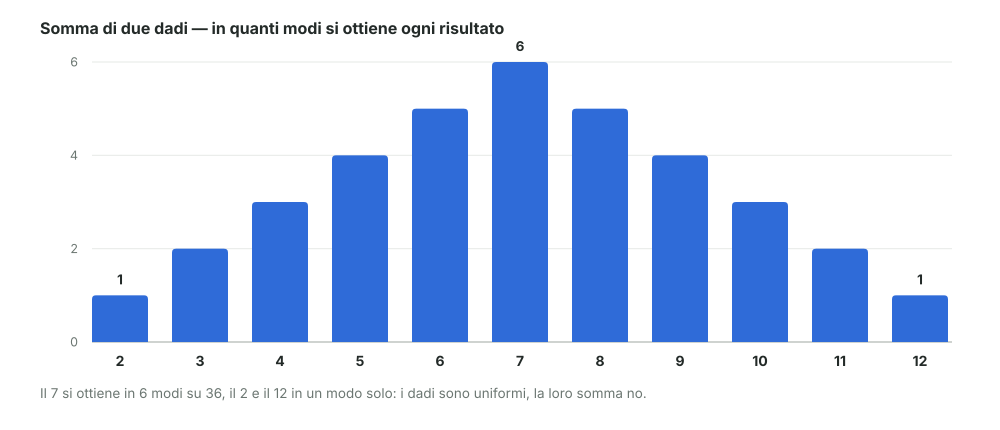

# 03 - Variabili casuali e statistiche

> Fonte Notion: https://app.notion.com/p/3c612abc808d81baaa1cda32814c544d — ultima modifica 2026-08-24T22:14:46.712Z

<table_of_contents color="gray"/>
Due idee nuove: le **variabili casuali** (il modo di associare numeri agli esiti) e le **statistiche** (i numeri che si ricavano dai dati osservati). Esempio guida: il lancio di **due dadi**.
---
## X oppure x: maiuscola e minuscola
Sugli appunti compaiono due scritture affiancate, ed è la distinzione fra **prima** e **dopo**.
<table fit-page-width="true" header-row="true">
<tr>
<td>Scrittura</td>
<td>Cos'è</td>
<td>Quando esiste</td>
<td>Sul dado</td>
</tr>
<tr>
<td>$`X`$ maiuscola</td>
<td>La **variabile casuale**: la regola che dice che uscirà un numero, e quali numeri sono possibili</td>
<td>Prima del lancio</td>
<td>"Il risultato del lancio", ancora da vedere</td>
</tr>
<tr>
<td>$`x_i`$ minuscola</td>
<td>La **realizzazione**: il numero effettivamente uscito</td>
<td>Dopo il lancio</td>
<td>4</td>
</tr>
</table>
Lanci tre volte e ottieni 4, 1, 6: quelli sono $`x_1, x_2, x_3`$. La $`X`$ invece resta sempre la stessa, prima di ogni lancio.
<callout icon="ℹ️" color="gray">
	**\[integrazione\] Nome nei libri.** Ciò che il docente chiama "evento di tipo casuale" nei testi si chiama **variabile aleatoria** (*random variable*). È la freccia `esito → numero` che era già comparsa nel modulo 01: una funzione che prende un esito e restituisce un numero.
</callout>
---
## Discrete e continue
La distinzione dipende da che tipo di numeri la variabile può produrre.
<table fit-page-width="true" header-row="true">
<tr>
<td>Tipo</td>
<td>Che valori</td>
<td>Esempi</td>
</tr>
<tr>
<td>**Discreta**</td>
<td>Valori separati, elencabili uno per uno. Fra due valori vicini non c'è niente</td>
<td>Il dado (1...6); il numero di clic su un banner (0, 1, 2, ...)</td>
</tr>
<tr>
<td>**Continua**</td>
<td>Valori su un intervallo, senza buchi. Fra due valori qualsiasi ce n'è sempre un altro</td>
<td>L'altezza di una persona; il tempo di risposta di un server</td>
</tr>
</table>
> **Regola pratica:** se puoi **contarli** è discreta, se puoi solo **misurarli** è continua. Sul dado non esiste il 3,5; su un'altezza il valore fra 1,73 e 1,74 esiste sempre.
---
## Cos'è una statistica
Lanci **due dadi** e ottieni due numeri, per esempio 3 e 5. Adesso puoi riassumerli con un numero solo:
- la **somma** → 8
- il **massimo** → 5
<callout icon="🎯" color="blue_bg">
	Una **statistica** è una funzione che prende i valori osservati e restituisce un numero. Nient'altro. Media, somma, massimo, minimo, varianza: sono tutte statistiche.
</callout>
---
## La tavola delle somme
Con due dadi le combinazioni possibili sono $`6 \times 6 = 36`$. La tavola incrocia il primo dado (colonne) con il secondo (righe), e in ogni casella c'è la somma. La diagonale evidenziata è quella dei **7**.
<table fit-page-width="true" header-row="true" header-column="true">
<tr>
<td>+</td>
<td>1</td>
<td>2</td>
<td>3</td>
<td>4</td>
<td>5</td>
<td>6</td>
</tr>
<tr>
<td>**1**</td>
<td>2</td>
<td>3</td>
<td>4</td>
<td>5</td>
<td>6</td>
<td color="blue_bg">7</td>
</tr>
<tr>
<td>**2**</td>
<td>3</td>
<td>4</td>
<td>5</td>
<td>6</td>
<td color="blue_bg">7</td>
<td>8</td>
</tr>
<tr>
<td>**3**</td>
<td>4</td>
<td>5</td>
<td>6</td>
<td color="blue_bg">7</td>
<td>8</td>
<td>9</td>
</tr>
<tr>
<td>**4**</td>
<td>5</td>
<td>6</td>
<td color="blue_bg">7</td>
<td>8</td>
<td>9</td>
<td>10</td>
</tr>
<tr>
<td>**5**</td>
<td>6</td>
<td color="blue_bg">7</td>
<td>8</td>
<td>9</td>
<td>10</td>
<td>11</td>
</tr>
<tr>
<td>**6**</td>
<td color="blue_bg">7</td>
<td>8</td>
<td>9</td>
<td>10</td>
<td>11</td>
<td>12</td>
</tr>
</table>
Contando quante volte compare ogni somma si ottiene la sua probabilità. Il docente lo scrive come $`P(\Sigma = k)`$:
$$
P(\Sigma = 2) = \tfrac{1}{36} \qquad P(\Sigma = 3) = \tfrac{2}{36} \qquad \dots \qquad P(\Sigma = 13) = 0
$$
> Il 13 vale **zero** perché con due dadi non si può ottenere: è l'evento impossibile del modulo 01, $`P(\emptyset) = 0`$.
---
## Il punto vero
I due dadi sono **equi**: ogni faccia ha probabilità $`1/6`$, tutte uguali. Ma la somma **non è affatto uniforme**.

Il 7 esce sei volte più spesso del 2, perché il 2 si ottiene in un solo modo (1+1) mentre il 7 in sei modi (1+6, 2+5, 3+4, 4+3, 5+2, 6+1).
E il massimo è sbilanciato ancora di più, in un'altra direzione:
<table fit-page-width="true" header-row="true">
<tr>
<td>Massimo</td>
<td>1</td>
<td>2</td>
<td>3</td>
<td>4</td>
<td>5</td>
<td>6</td>
</tr>
<tr>
<td>Casi su 36</td>
<td>1</td>
<td>3</td>
<td>5</td>
<td>7</td>
<td>9</td>
<td>11</td>
</tr>
</table>
Il 6 come massimo esce quasi un terzo delle volte: basta che **uno dei due** dadi faccia 6.
<callout icon="💡" color="blue_bg">
	**Da ingredienti uniformi sono uscite due distribuzioni completamente diverse** — diverse fra loro e diverse da quella dei dadi di partenza. La forma della distribuzione dipende dalla **statistica** che hai scelto, non solo dai dati.
</callout>
---
## La statistica è anch'essa casuale
La statistica che hai calcolato — somma, massimo — è **anch'essa un numero casuale**: cambia a ogni lancio. Quindi è a sua volta una variabile casuale, e **ha una sua distribuzione**, che è proprio quella del grafico e della tabella qui sopra.
---
## Riferimenti
- Dekking et al., *A Modern Introduction to Probability and Statistics*, cap. 4 ("Discrete random variables") e cap. 5 ("Continuous random variables")
