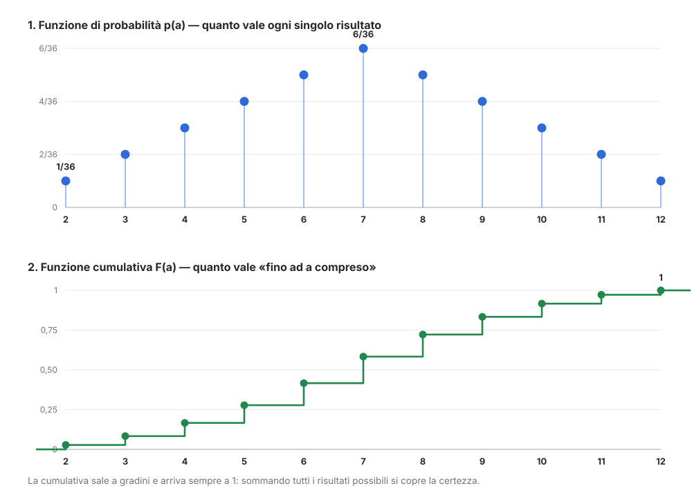

# 04 - Funzione di probabilità e cumulativa

> Fonte Notion: https://app.notion.com/p/3c612abc808d818c94fdebdcb446de86 — ultima modifica 2026-08-25T21:10:41.851Z

<table_of_contents color="gray"/>
Da qui non si guarda più il singolo risultato, ma **come la probabilità si distribuisce su tutti i risultati possibili**. L'esempio resta il lancio di **due dadi**.
<callout icon="💬" color="green_bg">
	**In parole semplici**
	Se lanci due dadi, certi risultati capitano spesso e altri quasi mai: il 7 esce di continuo, il 2 quasi mai. Questo capitolo mette per iscritto quel "quanto spesso", in due modi.
	Il primo dice **quanto è probabile ogni singolo risultato**: quanto vale il 7, quanto vale il 2.
	Il secondo dice **quanto è probabile quel risultato o uno più piccolo**: ad esempio la probabilità che esca 4 oppure meno.
	Sono gli stessi numeri guardati in due modi diversi. Nient'altro.
</callout>
---
## Lo spazio campionario di due dadi
Con un dado solo, $`\Omega = \{1,2,3,4,5,6\}`$. Con **due** dadi l'esito non è più un numero ma una **coppia** $`(d_1, d_2)`$:
$$
(1,1)\;(1,2)\;\dots\;(1,6) \quad \dots \quad (6,1)\;(6,2)\;\dots\;(6,6)
$$
In tutto **36 esiti**.
<callout icon="⚠️" color="yellow_bg">
	**Le coppie sono ordinate.** $`(1,2)`$ e $`(2,1)`$ contano come **due esiti diversi**, non uno. È esattamente il motivo per cui il 7 si ottiene in sei modi e il 2 in uno solo: se le coppie fossero non ordinate, metà dei conti salterebbe.
</callout>
La somma e il massimo sono **statistiche** calcolate su queste coppie: prendono una coppia e restituiscono un numero.
---
## La funzione di probabilità p(a)
Contando quante coppie danno ciascuna somma si ottiene, per ogni valore $`a`$, la sua probabilità. Il docente la scrive così:
$$
P(\Sigma = a) \equiv p(a)
$$
<table fit-page-width="true" header-row="true">
<tr>
<td>$`a`$ (somma)</td>
<td>$`p(a)`$ — probabilità di quel valore</td>
<td>$`F(a)`$ — cumulativa (sezione dopo)</td>
</tr>
<tr>
<td>2</td>
<td>1/36</td>
<td>1/36</td>
</tr>
<tr>
<td>3</td>
<td>2/36</td>
<td>3/36</td>
</tr>
<tr>
<td>4</td>
<td>3/36</td>
<td>6/36</td>
</tr>
<tr>
<td>5</td>
<td>4/36</td>
<td>10/36</td>
</tr>
<tr>
<td>6</td>
<td>5/36</td>
<td>15/36</td>
</tr>
<tr>
<td>**7**</td>
<td>**6/36**</td>
<td>21/36</td>
</tr>
<tr>
<td>8</td>
<td>5/36</td>
<td>26/36</td>
</tr>
<tr>
<td>9</td>
<td>4/36</td>
<td>30/36</td>
</tr>
<tr>
<td>10</td>
<td>3/36</td>
<td>33/36</td>
</tr>
<tr>
<td>11</td>
<td>2/36</td>
<td>35/36</td>
</tr>
<tr>
<td>12</td>
<td>1/36</td>
<td>36/36 = 1</td>
</tr>
</table>
**La funzione **$`p(a)`$** è definita per qualsiasi valore di **$`a`$, non solo da 2 a 12. Fuori da quell'intervallo vale semplicemente zero:
$$
p(a) = 0 \quad \text{per} \quad a < 2 \quad \text{oppure} \quad a > 12
$$
> Non è una formalità: significa che puoi chiedere $`p`$ di qualunque numero e ottenere sempre una risposta. Chiedere la probabilità che la somma sia 13 è lecito, e la risposta è 0.
<callout icon="🇬🇧" color="gray">
	**Nome inglese: *probability mass function*.** L'immagine è quella di una "massa" di probabilità distribuita sui valori possibili: ogni valore ne porta con sé un pezzetto, e sommando tutti i pezzetti si ottiene esattamente 1.
</callout>
---
## La funzione cumulativa F(a)
Invece di chiedere "quanto vale **esattamente** $`a`$?", si chiede "quanto vale **fino ad** $`a`$?".
$$
F(a) \;\equiv\; P(X \le a) \;=\; \sum_{a_i \le a} p(a_i)
$$
Si sommano le probabilità di tutti i valori minori o uguali ad $`a`$.
**Sul dado:**
$$
F(4) = p(2) + p(3) + p(4) = \tfrac{1}{36} + \tfrac{2}{36} + \tfrac{3}{36} = \tfrac{6}{36}
$$
cioè: la probabilità che la somma sia **al più** 4. I valori completi sono nella terza colonna della tabella qui sopra.
Tre proprietà che si leggono direttamente:
- **parte da 0** e **arriva a 1** — sommando tutti i risultati possibili si copre la certezza
- **non scende mai**: aggiungendo valori si possono solo aggiungere probabilità
- **sale a gradini**: fra un valore possibile e il successivo non cambia nulla
---
## Le due funzioni a confronto

Stesso fenomeno, due letture. In alto quanto pesa **ogni singolo** risultato; in basso quanto pesa **tutto ciò che sta fino lì**. L'altezza di ogni gradino della seconda è esattamente il punto corrispondente della prima.
---
## Riepilogo
<table fit-page-width="true" header-row="true">
<tr>
<td></td>
<td>$`p(a)`$</td>
<td>$`F(a)`$</td>
</tr>
<tr>
<td>**Risponde a**</td>
<td>"Quanto vale esattamente $`a`$?"</td>
<td>"Quanto vale al più $`a`$?"</td>
</tr>
<tr>
<td>**Si scrive**</td>
<td>$`P(X = a)`$</td>
<td>$`P(X \le a)`$</td>
</tr>
<tr>
<td>**Si calcola**</td>
<td>Contando i casi favorevoli</td>
<td>Sommando le $`p`$ fino ad $`a`$</td>
</tr>
<tr>
<td>**Sul dado, in 7**</td>
<td>$`6/36 \approx 17\%`$</td>
<td>$`21/36 \approx 58\%`$</td>
</tr>
<tr>
<td>**Forma del grafico**</td>
<td>Punti isolati</td>
<td>Scala a gradini che sale a 1</td>
</tr>
</table>
---
## Riferimenti
- Dekking et al., *A Modern Introduction to Probability and Statistics*, cap. 4 ("Discrete random variables")
