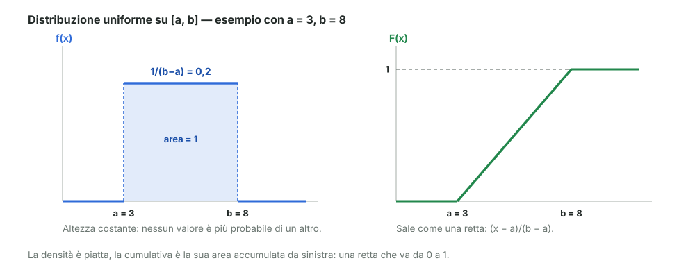
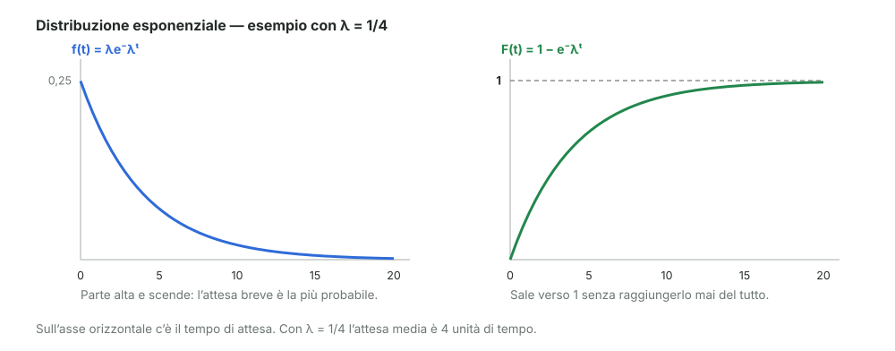

# 08 - Distribuzioni continue: uniforme ed esponenziale

> Fonte Notion: https://app.notion.com/p/3c712abc808d81489b04f3010a784c1b — ultima modifica 2026-08-25T21:10:54.370Z

<table_of_contents color="gray"/>
Due distribuzioni continue che ricorrono di continuo: la **uniforme** e la **esponenziale**.
<callout icon="💬" color="green_bg">
	**In parole semplici**
	**Uniforme**: tutti i valori di un intervallo sono ugualmente probabili. Come un numero estratto a caso fra 3 e 8, senza preferenze.
	**Esponenziale**: descrive **quanto devi aspettare** perché succeda qualcosa che capita a un ritmo costante — il prossimo clic su un sito, la prossima chiamata al centralino. Le attese brevi sono le più probabili, quelle lunghe diventano via via più rare.
</callout>
---
## La condizione che devono rispettare tutte
Prima di guardarle: qualunque distribuzione deve "pesare" in totale 1.
<table fit-page-width="true" header-row="true">
<tr>
<td>Caso</td>
<td>Condizione</td>
</tr>
<tr>
<td>Discreto</td>
<td>$`\sum_{\text{tutti}} p(a_i) = 1`$</td>
</tr>
<tr>
<td>Continuo</td>
<td>$`\int_{-\infty}^{+\infty} f(x)\,dx = 1`$</td>
</tr>
</table>
> Non è una formalità: è la condizione che **determina** le costanti delle formule che seguono. La densità dell'uniforme viene fuori proprio da qui.
---
## Distribuzione uniforme
Tutti i valori dell'intervallo $`[a, b]`$ hanno la stessa densità: $`f(x)`$ è **costante**, e vale zero fuori dall'intervallo.
Quanto vale quella costante? Basta imporre che l'area totale sia 1. L'area è quella di un rettangolo di base $`b-a`$ e altezza $`f`$, quindi $`f \cdot (b-a) = 1`$:
$$
f(x) = \frac{1}{b-a}
$$
Integrando si ottiene la cumulativa, che cresce come una retta:
$$
F(x) = \frac{x-a}{b-a}
$$

**Con** $`a = 3`$ **e** $`b = 8`$: la densità vale $`1/5 = 0{,}2`$ su tutto l'intervallo, e la cumulativa passa da 0 a 1 in modo lineare.

Perché l'integrale si spezza in tre pezzi

	Calcolando $`F(x)`$ si integra da $`-\infty`$ fino a $`x`$, ma $`f`$ vale zero quasi ovunque:
	- da $`-\infty`$ ad $`a`$ → la densità è zero, il contributo è **0**
	- da $`a`$ a $`x`$ → la densità è costante, il contributo è $`\tfrac{1}{b-a}(x-a)`$
	- da $`b`$ in poi → di nuovo zero
	Resta solo il pezzo centrale, e questo spiega la forma di $`F`$: costante a 0, poi una retta, poi costante a 1.

---
## Distribuzione esponenziale
Descrive il **tempo di attesa** prima che accada un evento che si presenta a ritmo costante.
Il parametro $`\lambda`$ è il **rate**, cioè quanti eventi capitano per unità di tempo. Nell'esempio del docente sono i clic su un sito:
$$
\lambda = \frac{\text{numero di clic}}{T}
$$
dove $`T`$ è il tempo di osservazione. Se osservi per un'ora e arrivano 60 clic, $`\lambda`$ vale un clic al minuto.
### Da dove viene la formula
Il ragionamento parte dal discreto e passa al limite:
- si spezza il tempo $`T`$ in $`n`$ intervallini piccolissimi, ciascuno lungo $`T/n`$
- in ogni intervallino la probabilità che l'evento capiti è $`\lambda T/n`$, e quella che **non** capiti è $`1 - \lambda T/n`$
- perché l'attesa superi $`T`$, l'evento non deve capitare in **nessuno** degli $`n`$ intervallini, e le probabilità si moltiplicano:
$$
P(t > T) = \left(1 - \frac{\lambda T}{n}\right)^{n}
$$
Facendo diventare gli intervallini infinitamente piccoli, cioè $`n \to \infty`$, quella espressione tende a un esponenziale:
$$
P(t > T) = e^{-\lambda T}
$$
<callout icon="💡" color="gray">
	È lo stesso schema della distribuzione geometrica — "quanti tentativi prima del successo" — con i tentativi che diventano istanti di tempo invece che prove separate. L'esponenziale è la versione continua di quella domanda.
</callout>
### Cumulativa e densità
La cumulativa è il complementare di quanto appena trovato:
$$
F(t) = P(t \le T) = 1 - P(t > T) = 1 - e^{-\lambda T}
$$
e la densità si ottiene derivando la cumulativa, come visto nel modulo precedente:
$$
f(t) = \frac{d}{dt}\left(1 - e^{-\lambda t}\right) = \lambda e^{-\lambda t}
$$

> **Come si legge il grafico di sinistra.** È più probabile aspettare poco che aspettare molto, e la probabilità cala senza mai azzerarsi del tutto: un'attesa lunghissima è rarissima ma non impossibile.
---
## Le due a confronto
<table fit-page-width="true" header-row="true">
<tr>
<td></td>
<td>Uniforme</td>
<td>Esponenziale</td>
</tr>
<tr>
<td>**Descrive**</td>
<td>Un valore a caso in un intervallo</td>
<td>Il tempo di attesa di un evento</td>
</tr>
<tr>
<td>**Parametri**</td>
<td>$`a`$ e $`b`$, gli estremi</td>
<td>$`\lambda`$, il ritmo degli eventi</td>
</tr>
<tr>
<td>**Densità** $`f`$</td>
<td>$`\dfrac{1}{b-a}`$, costante</td>
<td>$`\lambda e^{-\lambda t}`$, decrescente</td>
</tr>
<tr>
<td>**Cumulativa** $`F`$</td>
<td>$`\dfrac{x-a}{b-a}`$, una retta</td>
<td>$`1 - e^{-\lambda t}`$, sale verso 1</td>
</tr>
<tr>
<td>**Dove vive**</td>
<td>Solo fra $`a`$ e $`b`$</td>
<td>Da 0 in avanti, senza limite</td>
</tr>
</table>
---
## Riferimenti
- Dekking et al., *A Modern Introduction to Probability and Statistics*, cap. 5 ("Continuous random variables")
