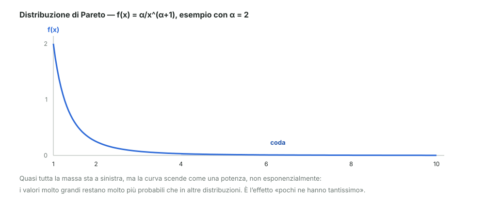
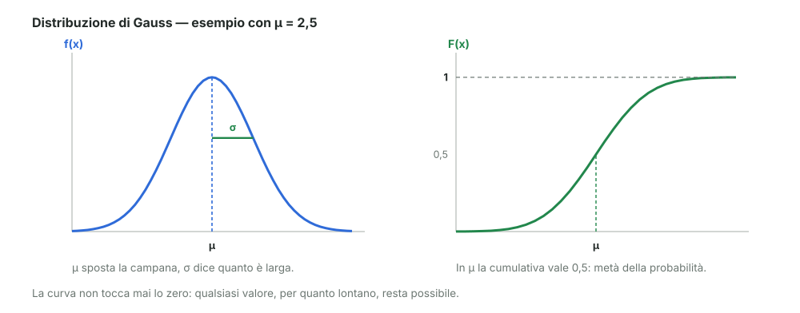

# 09 - Distribuzioni continue: Pareto e Gauss

> Fonte Notion: https://app.notion.com/p/3c712abc808d8166bcb6df6bf1b5e861 — ultima modifica 2026-08-25T09:32:39.222Z

<table_of_contents color="gray"/>
Altre due distribuzioni continue: la **Pareto**, che descrive i fenomeni molto sbilanciati, e la **Gauss**, la campana.
<callout icon="💬" color="green_bg">
	**In parole semplici**
	**Pareto**: descrive i fenomeni in cui pochissimi valori sono enormi e quasi tutti sono piccoli — i redditi, la dimensione delle città, l'energia dei terremoti. La sua firma è la **coda lunga**: i casi estremi non sono rari quanto ci si aspetterebbe.
	**Gauss**: descrive i fenomeni che si addensano attorno a un valore centrale, con scarti in su e in giù più o meno simmetrici. È la classica campana.
</callout>
---
## Distribuzione di Pareto
Nasce da un'**osservazione**, non da un ragionamento teorico. Guardando i redditi si nota una regolarità: la quota di persone che guadagna più di una certa cifra $`x`$ cala secondo una potenza di $`x`$.
$$
P(X > x) = \frac{c}{x^{\alpha}}
$$
Da qui si ricava la cumulativa, e derivandola si ottiene la densità (dopo aver sistemato la costante perché l'area totale faccia 1):
$$
f(x) = \frac{\alpha}{x^{\alpha+1}} \;=\; \text{Par}(\alpha)
$$

### Perché è diversa dalle altre
La differenza sta nel modo in cui scende. L'esponenziale del modulo precedente cala **esponenzialmente**, e questo azzera in fretta i valori grandi. Pareto cala come una **potenza**, molto più lentamente.
> Conseguenza concreta: in una distribuzione di Pareto i casi estremi sono rari ma **non trascurabili**, e spesso pesano più di tutti gli altri messi insieme. È il motivo per cui una piccola quota di persone detiene una parte enorme del reddito totale, e per cui pochi terremoti fortissimi rilasciano più energia di migliaia di scosse piccole.
### Dove si osserva
I fenomeni citati a lezione:
1. il **reddito**
2. la **crescita delle città** (estensione)
3. le **scosse sismiche**
4. il **volume delle abitazioni**
---
## Distribuzione di Gauss
$$
f(x) = \frac{1}{\sqrt{2\pi}\,\sigma}\; e^{-\frac{1}{2}\left(\frac{x-\mu}{\sigma}\right)^{2}}
$$
Definita su **tutto** l'asse reale: $`x \in (-\infty, +\infty)`$. Si indica con
$$
N(\mu,\ \sigma^{2})
$$
<table fit-page-width="true" header-row="true">
<tr>
<td>Parametro</td>
<td>Come si chiama</td>
<td>Cosa fa</td>
</tr>
<tr>
<td>$`\mu`$</td>
<td>Valore medio, **valore atteso**, valore di aspettazione</td>
<td>Dice **dove** sta il centro della campana</td>
</tr>
<tr>
<td>$`\sigma`$</td>
<td>Variabilità (deviazione standard); $`\sigma^2`$ è la varianza</td>
<td>Dice **quanto è larga**: $`\sigma`$ piccola dà una campana stretta e alta</td>
</tr>
</table>

Tre proprietà che si leggono dal disegno:
- è **simmetrica** attorno a $`\mu`$: scarti in su e in giù sono ugualmente probabili
- **non tocca mai lo zero**: qualsiasi valore, per quanto lontano, resta possibile — solo sempre meno probabile
- in $`\mu`$ la cumulativa vale esattamente **0,5**, cioè metà della probabilità sta a sinistra e metà a destra
<callout icon="⚠️" color="yellow_bg">
	**\[integrazione\] Sui numeri dell'esempio.** Negli appunti compaiono $`\mu = 2{,}5`$ e "6,0" accanto a $`\sigma`$. Dal disegno però il picco della campana vale circa $`0{,}15`$, e poiché l'altezza del picco è $`1/(\sqrt{2\pi}\,\sigma)`$, quel valore corrisponde a $`\sigma \approx 2{,}5`$. Il 6,0 è quindi la **varianza** $`\sigma^2`$, non $`\sigma`$ (infatti $`2{,}5^2 \approx 6`$). Coerente con la notazione $`N(\mu, \sigma^2)`$, dove il secondo posto ospita proprio la varianza.
</callout>
---
## Riferimenti
- Dekking et al., *A Modern Introduction to Probability and Statistics*, cap. 5 ("Continuous random variables")
