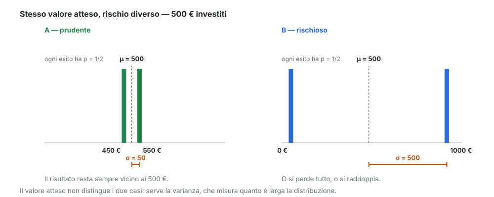
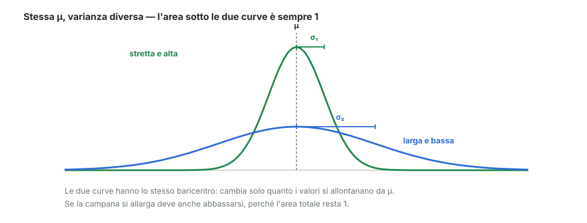

# 11 - Varianza

> Fonte Notion: https://app.notion.com/p/3c712abc808d81c5aaa3f93f20af152e — ultima modifica 2026-08-25T10:09:02.660Z

<table_of_contents color="gray"/>
Il valore atteso dice **dove sta** il centro della distribuzione. Non dice **quanto** i risultati si allontanano da quel centro.
<callout icon="💬" color="green_bg">
	**In parole semplici**
	La varianza misura **quanto sei lontano dal bersaglio, in media**.
	Per ogni risultato possibile guardi di quanto sbaglia rispetto a $`\mu`$, elevi al quadrato quello scarto (così negativo e positivo contano uguale), e fai la media pesata con le probabilità.
	Se la varianza è piccola, i risultati stanno stretti attorno a $`\mu`$. Se è grande, sono sparpagliati.
</callout>
---
## Perché il valore atteso da solo non basta
Esempio del docente. Investo **500 €** e ho due possibilità.
<table fit-page-width="true" header-row="true">
<tr>
<td>Caso</td>
<td>Esiti possibili</td>
<td>Probabilità</td>
<td>Valore atteso</td>
</tr>
<tr>
<td>**A** — prudente</td>
<td>450 € oppure 550 €</td>
<td>1/2 ciascuno</td>
<td>$`E[x] = 500`$</td>
</tr>
<tr>
<td>**B** — rischioso</td>
<td>0 € oppure 1000 €</td>
<td>1/2 ciascuno</td>
<td>$`E[x] = 500`$</td>
</tr>
</table>
I due investimenti hanno **lo stesso valore atteso**, ma nessuno direbbe che sono la stessa cosa. Serve un secondo numero che distingua il caso tranquillo da quello rischioso.

---
## Definizione
Si prende lo scarto dal valore atteso, $`x - E[x]`$, lo si eleva al quadrato e se ne fa il valore atteso:
$$
\mathrm{Var}[x] \;=\; E\big[(x - E[x])^2\big]
$$
Il quadrato serve a due cose: rende positivi tutti gli scarti (altrimenti quelli sopra e sotto $`\mu`$ si cancellerebbero a vicenda) e **pesa di più gli scostamenti grandi**.
<table fit-page-width="true" header-row="true">
<tr>
<td>Caso</td>
<td>Formula</td>
</tr>
<tr>
<td>**Discreto**</td>
<td>$`\mathrm{Var}[a] = \sum_i (a_i - \mu)^2 \, p(a_i)`$</td>
</tr>
<tr>
<td>**Continuo**</td>
<td>$`\mathrm{Var}[x] = \int (x - \mu)^2 f(x)\,dx`$</td>
</tr>
</table>
<callout icon="⚠️" color="yellow_bg">
	**\[integrazione\] Unità di misura.** La varianza è espressa nel **quadrato** dell'unità della variabile: se $`x`$ sono euro, $`\mathrm{Var}[x]`$ sono euro². Per tornare a un numero confrontabile con $`x`$ si prende la radice: la **deviazione standard** $`\sigma = \sqrt{\mathrm{Var}[x]}`$. È il $`\sigma`$ già incontrato nella Gauss.
</callout>
---
## I due investimenti, con i numeri
**Caso A**
$$
\mathrm{Var}_A = (450-500)^2 \cdot \tfrac{1}{2} + (550-500)^2 \cdot \tfrac{1}{2} = 2\,500 \quad\Rightarrow\quad \sigma_A = 50
$$
**Caso B**
$$
\mathrm{Var}_B = (0-500)^2 \cdot \tfrac{1}{2} + (1000-500)^2 \cdot \tfrac{1}{2} = 250\,000 \quad\Rightarrow\quad \sigma_B = 500
$$
Stesso centro, larghezza dieci volte diversa:
$$
\mu_A = \mu_B = \mu \qquad\text{ma}\qquad \sigma_A < \sigma_B
$$
---
## La varianza è la larghezza della pdf
È il modo giusto di leggerla: **la varianza dice quanto è larga la distribuzione**.
Due gaussiane con lo stesso $`\mu`$ e $`\sigma`$ diverso hanno entrambe area 1 sotto la curva, perché sono entrambe distribuzioni di probabilità. Quindi se una si allarga deve anche abbassarsi.

---
## Formula operativa
Per i calcoli si usa quasi sempre questa forma:
$$
\mathrm{Var}[x] \;=\; E\big[(x - E[x])^2\big] \;=\; E[x^2] - \big(E[x]\big)^2
$$
A parole: **la media dei quadrati meno il quadrato della media**. È comoda perché richiede solo due valori attesi, senza dover calcolare prima $`\mu`$ e poi ripassare su tutti gli scarti.

Da dove viene (due righe di conti)

	Si sviluppa il quadrato e si usa il fatto che $`E`$ è lineare e che $`\mu = E[x]`$ è un numero, non una variabile:
	$$
	E[(x-\mu)^2] = E[x^2 - 2\mu x + \mu^2] = E[x^2] - 2\mu E[x] + \mu^2
	$$
	Sostituendo $`E[x] = \mu`$:
	$$
	= E[x^2] - 2\mu^2 + \mu^2 = E[x^2] - \mu^2
	$$

---
## Sul dado
Un dado singolo. Dal modulo 10 sappiamo che $`E[x] = 3{,}5`$. Serve la media dei quadrati:
$$
E[x^2] = \frac{1 + 4 + 9 + 16 + 25 + 36}{6} = \frac{91}{6} \approx 15{,}17
$$
Quindi:
$$
\mathrm{Var}[x] = 15{,}17 - 3{,}5^2 = 15{,}17 - 12{,}25 = \frac{35}{12} \approx 2{,}92 \quad\Rightarrow\quad \sigma \approx 1{,}71
$$
Lettura: in media un lancio si discosta di circa **1,7 punti** da 3,5. Ha senso, visto che i risultati vanno da 1 a 6.
---
## Riferimenti
- Dekking et al., *A Modern Introduction to Probability and Statistics*, cap. 7 ("Expectation and variance")
