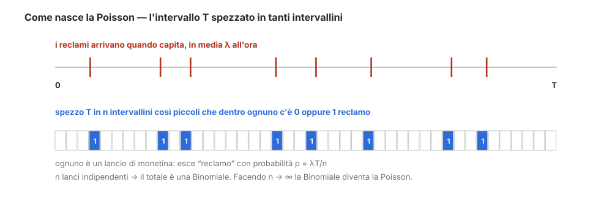

# 14 - Distribuzione di Poisson

> Fonte Notion: https://app.notion.com/p/3c712abc808d81c09667df0e2fa39540 — ultima modifica 2026-08-25T10:57:05.794Z

<table_of_contents color="gray"/>
La distribuzione che descrive **quanti eventi capitano in un certo tempo**, quando gli eventi arrivano a caso ma con un ritmo medio costante.
<callout icon="💬" color="green_bg">
	**In parole semplici**
	Uno sportello reclami. In media arrivano $`\lambda`$ reclami all'ora, ma non a orario fisso: capitano quando capitano.
	La Poisson risponde a: qual è la probabilità che oggi, in $`T`$ ore, ne arrivino esattamente $`k`$?
</callout>
---
## Le tre ipotesi
Perché il modello valga servono tre condizioni, come elencate a lezione:
<table fit-page-width="true" header-row="true">
<tr>
<td>Ipotesi</td>
<td>Cosa chiede</td>
</tr>
<tr>
<td>**1. Rate costante**</td>
<td>la frequenza media dei reclami è sempre la stessa: $`\lambda`$ = costante</td>
</tr>
<tr>
<td>**2. Omogeneità**</td>
<td>non ci sono cause che facciano variare $`\lambda`$ (uno sciopero, una promozione)</td>
</tr>
<tr>
<td>**3. Indipendenza**</td>
<td>quello che succede in un intervallo di tempo non influenza gli altri</td>
</tr>
</table>
---
## Come si costruisce
L'idea del docente: se non so trattare il continuo, lo **spezzo in tanti pezzetti discreti** che so già trattare.

Divido l'intervallo $`T`$ in $`n`$ intervallini di durata $`T/n`$. Se sono abbastanza piccoli, dentro ciascuno può esserci **0 oppure 1** reclamo: è una Bernoulli.
$$
p_i = \lambda \cdot \frac{T}{n} \qquad\qquad 1 - p_i = 1 - \frac{\lambda T}{n}
$$
Il totale $`N = R_1 + R_2 + \dots + R_n`$ è la somma di $`n`$ Bernoulli indipendenti, cioè una **Binomiale**:
$$
P(N = k) = \binom{n}{k} \left(\frac{\lambda T}{n}\right)^{k} \left(1 - \frac{\lambda T}{n}\right)^{n-k}
$$
---
## Il limite
Gli intervallini devono essere piccolissimi, quindi si fa $`n \to \infty`$:
$$
\lim_{n \to \infty} P(N = k) = \frac{(\lambda T)^{k}}{k!}\, e^{-\lambda T}
$$
Questa è la **Poisson di parametro **$`\lambda T`$.

I tre limiti, uno per pezzo

	Il coefficiente binomiale diviso $`n^k`$ tende a $`1/k!`$:
	$$
	\lim_{n\to\infty} \binom{n}{k}\frac{1}{n^{k}} = \lim_{n\to\infty} \frac{n}{n}\cdot\frac{n-1}{n}\cdots\frac{n-k+1}{n}\cdot\frac{1}{k!} = \frac{1}{k!}
	$$
	Il termine con esponente $`n`$ dà l'esponenziale:
	$$
	\lim_{n\to\infty}\left(1 - \frac{\lambda T}{n}\right)^{n} = e^{-\lambda T}
	$$
	Quello con esponente $`-k`$ (che è un numero fisso) tende a 1:
	$$
	\lim_{n\to\infty}\left(1 - \frac{\lambda T}{n}\right)^{-k} = 1
	$$

---
## Poisson ed esponenziale sono la stessa storia
Lo stesso identico processo si guarda da due lati:
<table fit-page-width="true" header-row="true">
<tr>
<td>Domanda</td>
<td>Risposta</td>
<td>Formula</td>
</tr>
<tr>
<td>Quanti eventi in un tempo $`x`$?</td>
<td>**Poisson**</td>
<td>$`P(k) = \dfrac{(\lambda x)^{k}}{k!}\, e^{-\lambda x}`$</td>
</tr>
<tr>
<td>Quanto aspetto fra un evento e il successivo?</td>
<td>**Esponenziale**</td>
<td>$`f(x) = \lambda e^{-\lambda x}`$</td>
</tr>
</table>
L'esponenziale del modulo 08 e la Poisson descrivono lo stesso fenomeno: una conta il numero, l'altra misura l'attesa.
---
## Riferimenti
- Dekking et al., *A Modern Introduction to Probability and Statistics*, cap. 12 ("The Poisson process")
