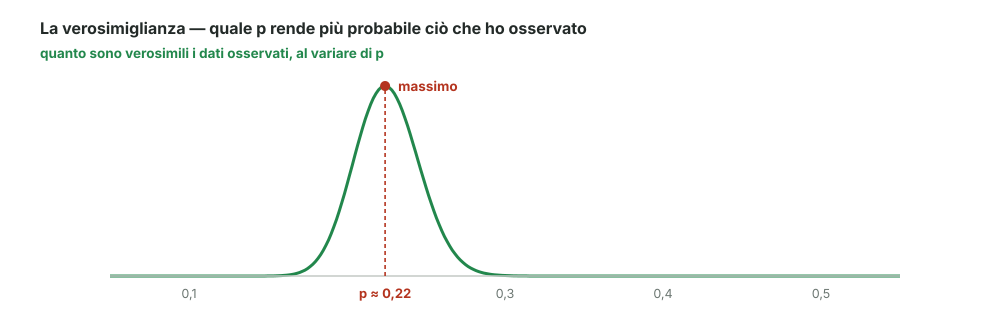

# 16 - Verosimiglianza

> Fonte Notion: https://app.notion.com/p/3c712abc808d81dc91d1eb8db90951c0 — ultima modifica 2026-08-25T14:03:08.194Z

<table_of_contents color="gray"/>
Finora, data una distribuzione, calcolavamo la probabilità dei dati. Qui si gira la domanda: **dati i dati, quale distribuzione?**
<callout icon="💬" color="green_bg">
	**In parole semplici**
	Ho osservato certi dati. Provo a chiedermi: se il parametro valesse 0,1, quanto sarebbe stato probabile ottenere proprio questi dati? E se valesse 0,2? E 0,3?
	La **verosimiglianza** è questa risposta, calcolata per ogni valore possibile del parametro. Il valore migliore è quello che la rende massima.
</callout>
---
## L'esempio: Weinberg &amp; Gladen
Studio degli anni '80 sul tempo necessario per concepire, misurato in **numero di cicli**, confrontando fumatrici e non fumatrici.
<table fit-page-width="true" header-row="true">
<tr>
<td>Cicli</td>
<td>1</td>
<td>2</td>
<td>3</td>
<td>4</td>
<td>5</td>
<td>6</td>
<td>7</td>
<td>8</td>
<td>9</td>
<td>10</td>
<td>11</td>
<td>12</td>
<td>&gt;12</td>
</tr>
<tr>
<td>**Fumatrici**</td>
<td>29</td>
<td>16</td>
<td>17</td>
<td>4</td>
<td>3</td>
<td>9</td>
<td>4</td>
<td>5</td>
<td>1</td>
<td>1</td>
<td>1</td>
<td>3</td>
<td>7</td>
</tr>
<tr>
<td>**Non fumatrici**</td>
<td>198</td>
<td>107</td>
<td>55</td>
<td>38</td>
<td>18</td>
<td>22</td>
<td>7</td>
<td>9</td>
<td>5</td>
<td>3</td>
<td>6</td>
<td>6</td>
<td>12</td>
</tr>
</table>
> In totale 100 fumatrici e 486 non fumatrici. L'ultima colonna raccoglie chi dopo 12 cicli non aveva ancora concepito: di loro non si sa il valore esatto, solo che è maggiore di 12.
La quantità da stimare è:
$$
p = \text{probabilità di concepire in un singolo ciclo}
$$
---
## La stima ingenua non basta
Il primo istinto è contare quante ce l'hanno fatta al primo tentativo:
$$
\frac{29}{100} \qquad\text{oppure, togliendo le 7 censurate,}\qquad \frac{29}{93}
$$
Ma così si butta via quasi tutta la tabella: chi ha concepito al terzo o al settimo ciclo porta informazione su $`p`$ e non viene usata. Serve un metodo che sfrutti **tutti** i dati.
---
## Il modello
Se ogni ciclo è un tentativo indipendente con probabilità $`p`$, il numero di cicli necessari segue la **geometrica** già vista nel modulo 05:
$$
P(x_i = k) = (1-p)^{k-1} \cdot p
$$
A parole: $`k-1`$ fallimenti di fila, poi il successo. Per chi ha superato i 12 cicli si sa solo che ha fallito 12 volte:
$$
P(x_i > 12) = (1-p)^{12}
$$
---
## Il principio di massima verosimiglianza
Moltiplicando le probabilità di tutte le donne osservate si ottiene la **probabilità di osservare esattamente il campione che ho ottenuto**. Questa quantità dipende da $`p`$, ed è la funzione di verosimiglianza.
<callout icon="🎯" color="blue_bg">
	**Il principio.** $`p`$ è il valore che **massimizza la probabilità di ottenere la realizzazione osservata**.
	In altre parole: fra tutte le spiegazioni possibili, scelgo quella sotto cui quello che ho visto era la cosa meno sorprendente.
</callout>

Il conto per le fumatrici, in breve

	Moltiplicando i contributi di tutte le 100 donne, la verosimiglianza è:
	$$
	L(p) = p^{93} \,(1-p)^{322}
	$$
	L'esponente 93 conta i successi osservati (le 93 che hanno concepito entro 12 cicli); il 322 conta tutti i cicli falliti, comprese le $`7 \times 12 = 84`$ mancate concezioni delle censurate.
	Si passa al logaritmo (il massimo non si sposta, ma i prodotti diventano somme) e si annulla la derivata:
	$$
	\frac{93}{p} = \frac{322}{1-p} \quad\Longrightarrow\quad \hat{p} = \frac{93}{415} \approx 0{,}22
	$$
	Sensibilmente più basso della stima ingenua $`29/93 \approx 0{,}31`$: usare tutta la tabella cambia la risposta.

---
## Riferimenti
- Dekking et al., *A Modern Introduction to Probability and Statistics*, cap. 21 ("Maximum likelihood")
