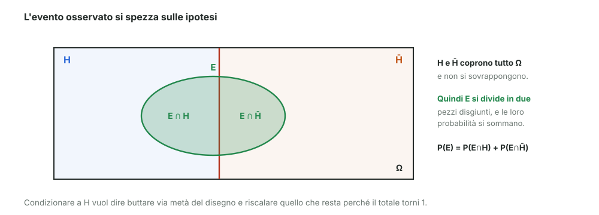
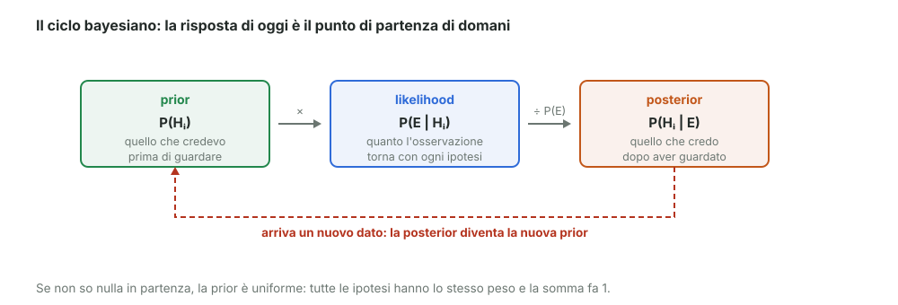

# 19 - Bayes: derivazione e linguaggio

> Fonte Notion: https://app.notion.com/p/3c712abc808d813cabe7fe80ca309ac9 — ultima modifica 2026-08-25T21:11:03.908Z

<table_of_contents color="gray"/>
Nel modulo 02 Bayes era comparso come formula. Qui si vede **da dove viene** e, soprattutto, come si chiamano i suoi pezzi — perché sono i nomi che si usano ovunque.
<callout icon="💬" color="green_bg">
	**In parole semplici**
	Hai un'idea di quanto sia probabile qualcosa. Poi arriva un fatto nuovo. Bayes ti dice esattamente di quanto devi cambiare idea.
	Esempio quotidiano: pensi che oggi pioverà con probabilità bassa. Poi vedi che il cielo si è fatto scuro. La tua nuova convinzione tiene conto di entrambe le cose: quanto ci credevi prima, e quanto quel cielo scuro è tipico dei giorni di pioggia.
</callout>
---
## La derivazione
Si parte da un evento osservato $`E`$, dal mondo $`\Omega`$ e da una **partizione** di $`\Omega`$: nel caso più semplice due sole ipotesi, $`H`$ e $`\bar{H}`$, con $`\Omega = H \cup \bar{H}`$.

Poiché la partizione è completa, l'evento $`E`$ si spezza in due pezzi che non si sovrappongono:
$$
P(E) = P\big((E \cap H) \cup (E \cap \bar{H})\big) = P(E \cap H) + P(E \cap \bar{H})
$$
Condizionare a $`H`$ significa restringersi a quel pezzo e rinormalizzare:
$$
P(E \mid H) = \frac{P(E \cap H)}{P(H)} \qquad\Longrightarrow\qquad P(E \cap H) = P(E \mid H)\, P(H)
$$

Perché si divide proprio per P(H)

	Il fattore di normalizzazione non è scelto a caso: è obbligato da un caso banale. Se assumo vera $`H`$, la probabilità di $`H`$ stessa deve valere 1:
	$$
	P(H \mid H) = 1
	$$
	Applicando la formula con un generico denominatore $`N`$:
	$$
	P(H \mid H) = \frac{P(H \cap H)}{N} = \frac{P(H)}{N}
	$$
	Perché il risultato faccia 1 serve $`N = P(H)`$. Non c'è alternativa.

La stessa cosa scambiando i ruoli:
$$
P(H \cap E) = P(H \mid E)\, P(E)
$$
Ma $`E \cap H`$ e $`H \cap E`$ sono lo stesso insieme. Quindi i due membri destri sono uguali:
$$
\boxed{\;P(E \mid H)\, P(H) = P(H \mid E)\, P(E)\;}
$$
Con una partizione di $`n`$ ipotesi $`\{H_i\}`$ invece di due, non cambia nulla:
$$
P(E \mid H_i)\, P(H_i) = P(H_i \mid E)\, P(E)
$$
---
## I nomi dei pezzi

$$
P(H_i \mid E) = \frac{P(E \mid H_i)\; P(H_i)}{P(E)}
$$
<table fit-page-width="true" header-row="true">
<tr>
<td>Termine</td>
<td>Nome</td>
<td>Che cosa dice</td>
</tr>
<tr>
<td>$`P(H_i)`$</td>
<td>**prior**</td>
<td>quanto credevo all'ipotesi prima di osservare</td>
</tr>
<tr>
<td>$`P(E \mid H_i)`$</td>
<td>**likelihood**</td>
<td>quanto l'osservazione è compatibile con quell'ipotesi</td>
</tr>
<tr>
<td>$`P(E)`$</td>
<td>probabilità dell'osservazione</td>
<td>fa da normalizzazione</td>
</tr>
<tr>
<td>$`P(H_i \mid E)`$</td>
<td>**posterior**</td>
<td>quanto ci credo dopo aver osservato</td>
</tr>
</table>
> La likelihood è la stessa dei moduli 16–18: qui ricompare come uno dei due fattori che aggiornano la convinzione.
---
## Le ipotesi devono coprire tutto
Perché la formula funzioni, la famiglia $`\{H_i\}`$ deve essere:
<table fit-page-width="true" header-row="true">
<tr>
<td>Requisito</td>
<td>In formula</td>
<td>A parole</td>
</tr>
<tr>
<td>**esclusive**</td>
<td>$`H_i \cap H_j = \varnothing`$</td>
<td>non si sovrappongono: non può essere vera più di una</td>
</tr>
<tr>
<td>**esaustive**</td>
<td>$`\bigcup_i H_i = \Omega`$</td>
<td>coprono tutto: almeno una è vera</td>
</tr>
</table>
È la definizione di partizione già vista nel modulo 01.
---
## Il denominatore è solo una normalizzazione
Non serve conoscere $`P(E)`$ da fuori: si ricava dagli stessi ingredienti, con la legge della probabilità totale del modulo 02.
$$
P(E) = P\Big(\bigcup_i (E \cap H_i)\Big) = \sum_i P(E \cap H_i) = \sum_i P(E \mid H_i)\, P(H_i)
$$
Quindi:
$$
P(H_i \mid E) = \frac{P(E \mid H_i)\, P(H_i)}{\sum_j P(E \mid H_j)\, P(H_j)}
$$
<callout icon="💡" color="blue_bg">
	Il denominatore è la **stessa somma** che sta al numeratore, fatta su tutte le ipotesi. Serve solo a far tornare il totale a 1. Il docente lo chiama semplicemente $`\alpha`$, la costante di normalizzazione.
</callout>
---
## La ricetta in quattro passi
Il docente l'ha numerata così, ed è l'ordine in cui si fanno davvero i conti:
<table fit-page-width="true" header-row="true">
<tr>
<td>#</td>
<td>Passo</td>
<td>Formula</td>
</tr>
<tr>
<td>1</td>
<td>**prior** — la conoscenza a priori</td>
<td>$`P(H_i)`$</td>
</tr>
<tr>
<td>2</td>
<td>**likelihood** — quanto l'osservazione torna con ogni ipotesi</td>
<td>$`P(E \mid H_i)`$</td>
</tr>
<tr>
<td>3</td>
<td>**normalizzazione**</td>
<td>$`\alpha = \dfrac{1}{\sum_i P(E \mid H_i)\,P(H_i)}`$</td>
</tr>
<tr>
<td>4</td>
<td>**posterior** — il risultato finale</td>
<td>$`P(H_i \mid E) = \alpha \cdot P(E \mid H_i)\,P(H_i)`$</td>
</tr>
</table>
---
## Se non so nulla: prior uniforme
Quando non c'è motivo di preferire un'ipotesi, si dà a tutte lo stesso peso:
$$
P(H_i) = \text{costante}, \qquad \sum_i P(H_i) = 1
$$
Con $`n`$ ipotesi, ciascuna vale $`1/n`$. È il punto di partenza più onesto quando si parte a mani vuote.
---
## La procedura è iterativa
Questo è il punto che il docente ha sottolineato disegnando una freccia che torna indietro:
1. parto da una prior $`P_0(H_i)`$
2. osservo un evento e calcolo la likelihood $`P(E \mid H_i)`$
3. normalizzo
4. ottengo la posterior $`P(H_i \mid E)`$, cioè la convinzione **aggiornata all'evento E**
5. arriva un nuovo dato: la posterior di ieri diventa la **prior di oggi**, e si ricomincia
Ogni osservazione sposta un po' la convinzione. Se i dati sono tanti, il punto di partenza conta sempre meno.
---
## Riferimenti
- D'Agostini, *Bayesian Reasoning in Data Analysis*, cap. 1–3
- Dekking et al., cap. 3
