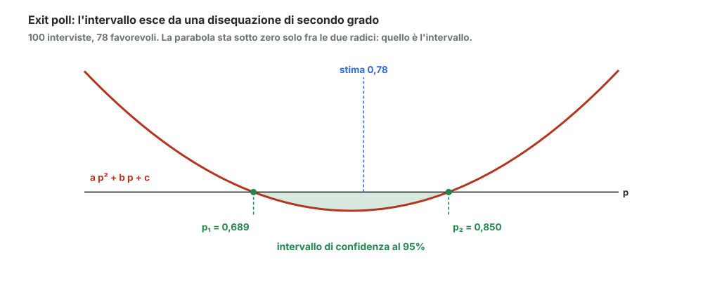

# 23 - Intervallo di confidenza per una percentuale

> Fonte Notion: https://app.notion.com/p/3c712abc808d81af827cd2cf3f366a56 — ultima modifica 2026-08-25T21:11:16.935Z

<table_of_contents color="gray"/>
Stesso problema del modulo 22, ma il dato non è una media: è una **percentuale**. Cambia il conto, e in un punto sorprendente.
<callout icon="💬" color="green_bg">
	**In parole semplici**
	Exit poll. Fermo 100 persone all'uscita del seggio e 78 dicono di aver votato SÌ.
	Posso dire che il SÌ è al 78%? No: ho intervistato 100 persone, non tutte. La domanda giusta è: fra quali due percentuali sta il valore vero?
</callout>
---
## L'impostazione
Ogni intervista è un successo o un fallimento, quindi il numero di SÌ segue una **binomiale** $`\mathrm{Bin}(n, p)`$, con $`p`$ la percentuale vera di favorevoli (modulo 05).
La stima naturale è la frequenza osservata:
$$
\hat{p} = \frac{\text{numero di voti favorevoli}}{n} = \frac{k}{n} = \frac{78}{100}
$$
E si cerca l'intervallo tale che $`P(L < p < U) = \gamma = 1 - \alpha`$.
---
## Si passa alla gaussiana
Per $`n`$ grande la binomiale si approssima con una gaussiana. Standardizzando con media $`np`$ e deviazione standard $`\sqrt{np(1-p)}`$:
$$
z = \frac{k - np}{\sqrt{n\,p(1-p)}}
$$
Dividendo sopra e sotto per $`n`$ si ottiene la forma comoda, tutta in termini di frequenze:
$$
z = \frac{\dfrac{k}{n} - p}{\sqrt{\dfrac{p(1-p)}{n}}}
$$
E si impone come sempre che $`z`$ stia fra i valori critici:
$$
P\left(-z_{\alpha/2} < \frac{k/n - p}{\sqrt{p(1-p)/n}} < z_{\alpha/2}\right) = \gamma
$$
---
## Il punto dove cambia tutto
<callout icon="⚠️" color="yellow_bg">
	**Qui non si può isolare **$`p`$** come prima.** Nel caso della media, $`\sigma`$ stava solo al denominatore ed era una costante nota. Qui $`p`$ compare **due volte**: al numeratore come quantità da stimare, e al denominatore dentro $`\sqrt{p(1-p)/n}`$.
	Non si può spostare a sinistra e a destra: bisogna risolvere.
</callout>
Elevando al quadrato per togliere la radice e portando tutto a sinistra:
$$
\left(\frac{k}{n} - p\right)^{2} - z_{\alpha/2}^{2}\;\frac{p(1-p)}{n} \;<\; 0
$$
Sviluppando, questa è una **disequazione di secondo grado in **$`p`$:
$$
a\,p^{2} + b\,p + c < 0
$$
Si trovano le due radici con la formula di sempre e l'intervallo di confidenza è quello **fra le due radici**, perché la parabola sta sotto zero solo lì.
$$
p_{1,2} = \frac{-b \pm \sqrt{b^{2} - 4ac}}{2a}
$$
---
## L'esempio dell'exit poll

Con $`n = 100`$, $`k = 78`$ e $`\gamma = 95\%`$ (quindi $`z_{\alpha/2} = 1{,}96`$):
$$
\left(\frac{78}{100} - p\right)^{2} - \frac{(1{,}96)^{2}}{100}\,p(1-p) < 0
$$

I coefficienti e le radici

	Sviluppando il quadrato e raccogliendo le potenze di $`p`$, con $`z^2 = 3{,}8416`$:
	$$
	a = 1 + \frac{z^2}{n} = 1{,}0384 \qquad b = -\left(2\frac{k}{n} + \frac{z^2}{n}\right) = -1{,}5984 \qquad c = \left(\frac{k}{n}\right)^{2} = 0{,}6084
	$$
	Da cui:
	$$
	p_1 \approx 0{,}689 \qquad\qquad p_2 \approx 0{,}850
	$$

**Risultato:** il SÌ sta fra il **68,9% e l'85,0%**, con confidenza 95%.
<callout icon="🎯" color="blue_bg">
	Con 100 interviste il margine è di circa **±8 punti**. È il motivo per cui i sondaggi seri ne fanno migliaia: l'ampiezza si stringe come $`1/\sqrt{n}`$, quindi per dimezzarla servono quattro volte più interviste.
</callout>
---
## Nota sulla simmetria
Un dettaglio usato nei conti: per la gaussiana standard, tagliare in alto o in basso è la stessa cosa a segno cambiato.
$$
z_{1-P} = -z_{P}
$$
È quello che permette di scrivere l'intervallo come $`\pm z_{\alpha/2}`$ invece di due valori distinti.
---
## Riferimenti
- Dekking et al., *A Modern Introduction to Probability and Statistics*, cap. 23–24
