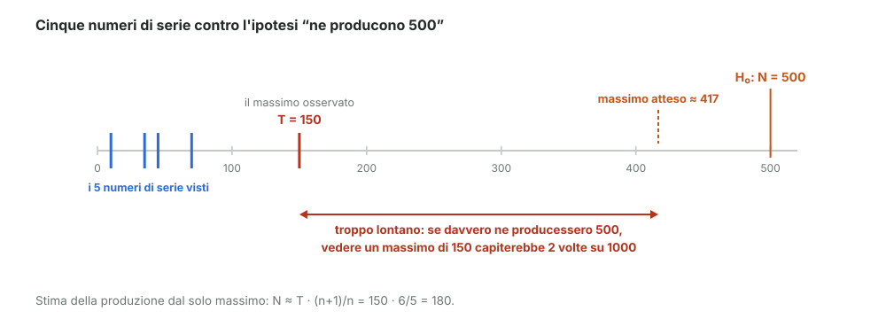

# 24 - Setup di un test di ipotesi

> Fonte Notion: https://app.notion.com/p/3c712abc808d817593b4e1fc42def3b5 — ultima modifica 2026-08-25T21:11:26.700Z

<table_of_contents color="gray"/>
Nel modulo 21 c'erano le definizioni. Qui si monta un test vero, dall'inizio alla fine, su un esempio che vale la pena ricordare.
<callout icon="💬" color="green_bg">
	**In parole semplici**
	Un'azienda produce veicoli speciali e li numera progressivamente: 1, 2, 3, e così via.
	Ne vedo cinque per strada e leggo i numeri di targa. Quanti ne avranno prodotti in tutto? E se qualcuno mi dice “cinquecento”, i numeri che ho visto lo confermano o lo smentiscono?
</callout>
---
## Le due ipotesi
<table fit-page-width="true" header-row="true">
<tr>
<td>Ipotesi</td>
<td>Contenuto</td>
</tr>
<tr>
<td>$`H_0`$ — nulla</td>
<td>produzione $`N = 500`$ — è **l'ipotesi in cui crediamo**, quella da mettere alla prova</td>
</tr>
<tr>
<td>$`H_1`$ — alternativa</td>
<td>$`N < 500`$ oppure $`N > 500`$ — **l'insieme di tutte le ipotesi complementari**</td>
</tr>
</table>
> $`H_1`$ non è una singola ipotesi: è tutto quello che resta. Per questo si formula sempre $`H_0`$ come l'affermazione precisa.
---
## Popolazione e campione
<table fit-page-width="true" header-row="true">
<tr>
<td>Cosa</td>
<td>Simbolo</td>
<td>Nel nostro caso</td>
</tr>
<tr>
<td>**popolazione**</td>
<td>$`\{X_i\}`$, di dimensione $`N`$</td>
<td>tutti i veicoli prodotti (non li vediamo)</td>
</tr>
<tr>
<td>**campione**</td>
<td>$`\{x_i\}`$, di dimensione $`n`$</td>
<td>i 5 veicoli che ho osservato</td>
</tr>
</table>
---
## Serve una statistica
Per decidere non basta guardare i dati: serve **un numero solo** calcolato dal campione. Il docente lo chiama $`T`$.
Qui la scelta naturale è il più grande numero visto:
$$
T = \max\{x_1, x_2, x_3, x_4, x_5\}
$$
Ha una proprietà comoda: il suo valore atteso è legato in modo semplice a $`N`$.
$$
E[T] \;\approx\; N \cdot \frac{n}{n+1}
$$
Con 5 osservazioni, il massimo osservato vale in media **5/6 del massimo vero**. Girando la formula si ottiene una stima:
$$
\hat{N} \;\approx\; T \cdot \frac{n+1}{n}
$$
---
## Il campione osservato
I cinque numeri letti sono:
$$
\{70,\; 45,\; 150,\; 10,\; 35\} \qquad\Longrightarrow\qquad T = 150
$$

---
## La domanda del test
Se davvero $`N = 500`$, quanto sarebbe stato probabile osservare un massimo così basso?
$$
P(\max \le 150 \;\mid\; N = 500) = \frac{150}{500}\cdot\frac{149}{499}\cdot\frac{148}{498}\cdot\frac{147}{497}\cdot\frac{146}{496} \;\approx\; 0{,}0023 \;=\; 0{,}23\%
$$

Da dove viene quel prodotto

	Si chiede che **tutti e cinque** i veicoli osservati abbiano numero $`\le 150`$.
	Il primo ha 150 possibilità favorevoli su 500. Una volta preso quello, restano 149 favorevoli su 499 (non si osserva due volte lo stesso veicolo). E così via per cinque volte.
	$$
	P = \frac{150 \cdot 149 \cdot 148 \cdot 147 \cdot 146}{500 \cdot 499 \cdot 498 \cdot 497 \cdot 496} = \frac{7{,}10 \times 10^{10}}{3{,}06 \times 10^{13}}
	$$
	Se si ignora il “senza ripetizione” il conto diventa semplicemente $`(150/500)^5 = 0{,}0024`$: praticamente lo stesso risultato.

**Conclusione:** con $`\alpha = 5\%`$ questo valore è molto sotto soglia. L'ipotesi $`N = 500`$ si rifiuta.
---
## Cosa succede se il massimo è più alto
Cambiando un solo dato — se invece di 150 avessi letto 260:
$$
P(\max \le 260 \mid N = 500) = \frac{260}{500}\cdot\frac{259}{499}\cdots\frac{256}{496} \;\approx\; 0{,}037 \;=\; 3{,}7\%
$$
<table fit-page-width="true" header-row="true">
<tr>
<td>Massimo osservato</td>
<td>Probabilità sotto $`H_0`$</td>
<td>Stima $`\hat{N}`$</td>
<td>Decisione con $`\alpha = 5\%`$</td>
</tr>
<tr>
<td>**150**</td>
<td>0,23%</td>
<td>180</td>
<td>rifiuto $`H_0`$</td>
</tr>
<tr>
<td>**260**</td>
<td>3,7%</td>
<td>312</td>
<td>rifiuto $`H_0`$, ma di misura</td>
</tr>
</table>
> Si vede bene quanto la conclusione dipenda dalla soglia scelta: con $`\alpha = 1\%`$ il secondo caso non verrebbe rifiutato.
<callout icon="⚠️" color="yellow_bg">
	**\[nota\]** Sul video i due valori si leggono come 0,36% e 5,7%. Rifacendo il prodotto vengono 0,23% e 3,7%: la differenza sta nel denominatore, arrotondato a $`2{,}0 \times 10^{13}`$ invece di $`3{,}06 \times 10^{13}`$. Le conclusioni non cambiano.
</callout>
<callout icon="💡" color="blue_bg">
	**\[integrazione\] Non è un esempio inventato.** Durante la Seconda guerra mondiale gli Alleati stimarono la produzione di carri armati tedeschi esattamente così, dai numeri di serie di quelli catturati. Le stime statistiche risultarono molto più vicine ai dati reali di quelle dell'intelligence.
</callout>
---
## Lo schema generale
1. si formula $`H_0`$ in modo preciso, e $`H_1`$ come tutto il resto
2. si sceglie una **statistica** $`T`$ calcolabile dal campione
3. si calcola quanto sarebbe stato probabile ottenere un valore come quello osservato, **assumendo vera **$`H_0`$
4. si confronta con la soglia $`\alpha`$ e si decide
---
## Riferimenti
- Dekking et al., *A Modern Introduction to Probability and Statistics*, cap. 25
