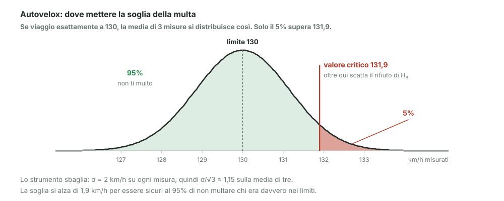

# 26 - Valore critico e regione di rifiuto: l'autovelox

> Fonte Notion: https://app.notion.com/p/3c712abc808d81aaa4e8d52c37d226fe — ultima modifica 2026-08-25T21:11:18.858Z

<table_of_contents color="gray"/>
Un test completo, dall'inizio alla decisione, su un esempio che tutti conoscono — e che spiega perché esiste la tolleranza sugli autovelox.
<callout icon="💬" color="green_bg">
	**In parole semplici**
	Il limite è 130. L'autovelox misura 130,4. Ti multa?
	No: perché lo strumento sbaglia sempre un po'. Se multasse a 130,1 finirebbe per multare tanti automobilisti che stavano davvero sotto il limite. La soglia va alzata quanto basta a rendere quell'errore raro.
</callout>
---
## L'impostazione
<table fit-page-width="true" header-row="true">
<tr>
<td>Elemento</td>
<td>Valore</td>
</tr>
<tr>
<td>Limite di legge</td>
<td>$`v_{\text{limite}} = 130`$ km/h</td>
</tr>
<tr>
<td>Incertezza dello strumento</td>
<td>$`\sigma^2 = 4`$, cioè $`\sigma = 2`$ km/h</td>
</tr>
<tr>
<td>Misure effettuate</td>
<td>3 velocità, $`x_1, x_2, x_3`$</td>
</tr>
<tr>
<td>Modello</td>
<td>$`X \sim \text{Gauss}(\mu, \sigma^2)`$</td>
</tr>
</table>
> Gli strumenti ideali non esistono: ogni misura porta con sé un'incertezza, e questa è la ragione per cui serve la statistica invece di un semplice confronto.
**Il set-up del test:**
$$
H_0: \mu = 130 \qquad\qquad H_1: \mu > 130
$$
La statistica è la stima di $`\mu`$, cioè la media delle tre misure:
$$
T = \bar{X} = \frac{x_1 + x_2 + x_3}{3}
$$
<callout icon="🎯" color="blue_bg">
	**Questo è un test a una coda.** $`H_1`$ dice solo $`\mu > 130`$: a nessuno interessa multare chi va troppo piano. Per questo tutta la probabilità di errore, il 5%, va messa in **una sola** coda, non metà per parte come negli intervalli di confidenza del modulo 22.
</callout>
---
## La condizione
Si impone che, per chi viaggia esattamente al limite, la probabilità di essere multato per errore sia al massimo il 5%:
$$
P(\bar{X} > 130 \;\mid\; \mu = 130) = 0{,}05
$$
Questo è esattamente l'**errore di I tipo**: rifiutare $`H_0`$ quando $`H_0`$ era vera, cioè multare un innocente.
---
## Il conto
La media di 3 misure è più precisa della singola misura:
$$
\bar{X} \sim \text{Gauss}\!\left(\mu,\; \frac{\sigma^2}{3}\right) \qquad\Longrightarrow\qquad \frac{\sigma}{\sqrt{3}} = \frac{2}{\sqrt{3}} \approx 1{,}15
$$
Standardizzando:
$$
z = \frac{\bar{X} - \mu}{\sigma/\sqrt{3}} \;\sim\; N(0,1)
$$
Si cerca il valore critico $`z_c`$ che lascia il 5% **a destra** (una coda sola):
$$
P(z > z_c) = 0{,}05 \qquad\Longrightarrow\qquad z_c = 1{,}645
$$
<callout icon="⚠️" color="yellow_bg">
	**1,645 e non 1,96.** Il valore del modulo 22 era 1,96 perché lì il 5% era diviso fra due code (2,5% ciascuna). Qui tutto il 5% sta a destra, quindi il taglio è più vicino al centro.
</callout>
Tornando alle velocità:
$$
\frac{\bar{X} - \mu}{\sigma/\sqrt{3}} > 1{,}645 \qquad\Longrightarrow\qquad \bar{X} > \mu + 1{,}645\cdot\frac{2}{\sqrt{3}} = 130 + 1{,}9
$$
$$
\boxed{\;\bar{x}_c = 131{,}9 \ \text{km/h}\;}
$$
---
## Il risultato letto sul disegno

<callout icon="💡" color="blue_bg">
	**\[integrazione\] È il motivo per cui la multa non scatta a 130,1.** La tolleranza applicata agli autovelox non è un favore all'automobilista: è il margine che serve perché lo strumento non condanni chi era davvero nei limiti. La statistica dice dove metterlo.
</callout>
---
## Il vocabolario
<table fit-page-width="true" header-row="true">
<tr>
<td>Termine</td>
<td>Significato</td>
</tr>
<tr>
<td>**valore critico** $`x_c`$</td>
<td>la soglia oltre la quale si rifiuta $`H_0`$</td>
</tr>
<tr>
<td>**regione critica**</td>
<td>l'insieme dei valori che portano al rifiuto: qui $`x \in (x_c, \infty)`$</td>
</tr>
<tr>
<td>**livello di significatività** $`\alpha`$</td>
<td>la probabilità di errore di I tipo accettata; 5% è lo standard, ma **si sceglie a priori**</td>
</tr>
</table>
La regola operativa:
$$
x > x_c \quad\Longrightarrow\quad \text{rifiuto } H_0, \ \text{sapendo che l'errore di I tipo vale } 5\%
$$
<callout icon="🎯" color="blue_bg">
	**Due definizioni precise, dalle parole del docente.**
	$`\alpha`$ è il **livello massimo di errore di I tipo che siamo disposti a tollerare**. Non è l'errore che commettiamo: è il tetto che ci diamo prima di guardare i dati.
	$`x_c`$ è **il valore per il quale il p-value è esattamente **$`\alpha`$. Sopra quel punto il p-value scende sotto soglia, sotto quel punto sale.
</callout>
---
## Valore critico e p-value sono la stessa cosa
Sono due modi di dire la stessa decisione, guardata dai due lati.
<table fit-page-width="true" header-row="true">
<tr>
<td>Approccio</td>
<td>Cosa si confronta</td>
<td>Rifiuto se</td>
</tr>
<tr>
<td>**valore critico**</td>
<td>il dato misurato con la soglia</td>
<td>$`x > x_c`$</td>
</tr>
<tr>
<td>**p-value**</td>
<td>una probabilità con un'altra</td>
<td>$`\text{p-value} \le \alpha`$</td>
</tr>
</table>
La **regione critica** è quindi definibile in entrambi i modi:
$$
x \in [\,x_c,\; \infty) \qquad\Longleftrightarrow\qquad \text{p-value} \le 0{,}05
$$
---
## Lo schema completo
1. si parte dal campione $`\{x_i\}`$
2. si formulano $`H_0`$ — “quello che descrive **naturalmente** i dati” — e $`H_1`$ come complementare
3. si **istanzia una statistica** $`T`$ su cui basare la decisione, che ammette due esiti: rifiuto $`H_0`$, oppure non lo rifiuto
4. si misurano i parametri associati a $`T`$ e si calcola il suo valore $`t = T\{x_i\}`$
5. si calcola la probabilità di errore di I tipo, cioè il p-value
6. si rifiuta $`H_0`$ **se e solo se** quella probabilità resta entro $`\alpha`$
---
## Riferimenti
- Dekking et al., *A Modern Introduction to Probability and Statistics*, cap. 25–26
