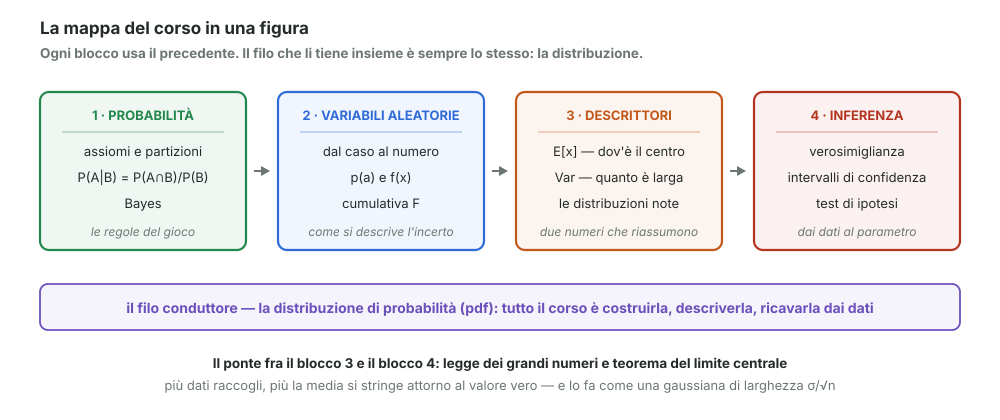
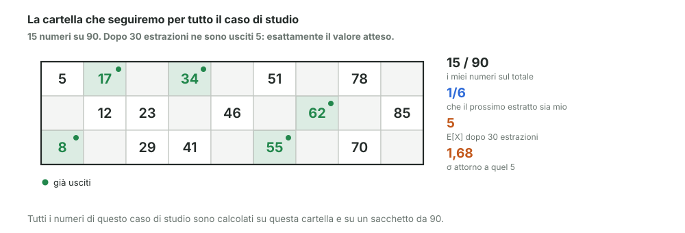

# ⭐ Bignami - i 10 concetti da sapere

> Fonte Notion: https://app.notion.com/p/3c712abc808d81b5adbed4f59e62dbf6 — ultima modifica 2026-08-25T21:26:02.651Z

<table_of_contents color="gray"/>
Tutto il corso in una pagina. Ogni concetto: la formula, cosa vuol dire, l'esempio, e la trappola in cui si casca.
In fondo, gli stessi dieci concetti rifatti su **un unico caso di studio: una serata di tombola**.

---
## 1. Probabilità condizionata
$$
P(A \mid B) = \frac{P(A \cap B)}{P(B)}
$$
**Cosa fa:** butta via il pezzo di mondo incompatibile con $`B`$ e riscala quello che resta perché il totale torni 1.
**Esempio:** so già che il mese ha la “r” nel nome; fra questi, quanti sono lunghi?
<callout icon="⚠️" color="yellow_bg">
	**Trappola:** a sinistra della barra sta la cosa che voglio sapere, a destra quella che già so. $`P(A|B)`$ e $`P(B|A)`$ sono numeri diversi.
</callout>
→ moduli [01](01-probabilita-linguaggio-e-assiomi.md) e [02](02-probabilita-condizionata.md)
---
## 2. Teorema di Bayes
$$
\underbrace{P(H_i \mid E)}_{\text{posterior}} = \frac{\overbrace{P(E \mid H_i)}^{\text{likelihood}} \cdot \overbrace{P(H_i)}^{\text{prior}}}{P(E)}
$$
**Cosa fa:** dice di quanto cambiare idea quando arriva un dato nuovo. Il denominatore è solo normalizzazione: $`P(E) = \sum_i P(E|H_i)P(H_i)`$.
**Esempio:** pensavo piovesse poco; vedo il cielo scuro; aggiorno.
<callout icon="🎯" color="blue_bg">
	**Da ricordare:** la posterior di oggi è la prior di domani. E se non so nulla, prior uniforme.
</callout>
→ modulo [19](19-bayes-derivazione-e-linguaggio.md)
---
## 3. Variabile aleatoria: p(a) e F(a)
$$
p(a) = P(X = a) \qquad\qquad F(a) = P(X \le a) = \sum_{k \le a} p(k)
$$
**Cosa fa:** trasforma un esito qualsiasi in un numero, e ne descrive il comportamento. La cumulativa non scende mai e arriva a 1.
**Esempio:** somma di due dadi — $`p(7) = 6/36`$, il valore più probabile.
<callout icon="⚠️" color="yellow_bg">
	**Trappola:** “evento” è il sottoinsieme, “esito” è il singolo risultato. Sulla stessa prova si possono calcolare più statistiche diverse (somma, massimo…).
</callout>
→ moduli [03](03-variabili-casuali-e-statistiche.md) e [04](04-funzione-di-probabilita-e-cumulativa.md)
---
## 4. Nel continuo: densità, non probabilità
$$
P(a \le X \le b) = \int_a^b f(x)\,dx \qquad\qquad f(x) = \frac{dF}{dx} \qquad\qquad \int_{-\infty}^{+\infty} f(x)\,dx = 1
$$
**Cosa fa:** con infiniti valori possibili la probabilità di un punto è zero, quindi si misura l'**area** sotto la curva.
**Esempio:** “altezza esattamente 1,7523 m” ha probabilità zero; “fra 1,75 e 1,76” no.
<callout icon="⚠️" color="yellow_bg">
	**Trappola:** $`f(x)`$ non è una probabilità e può valere più di 1. La probabilità è sempre un'area.
</callout>
→ moduli [06](06-dal-discreto-al-continuo.md) e [07](07-cumulativa-e-densita-nel-continuo.md)
---
## 5. Le distribuzioni da riconoscere
<table fit-page-width="true" header-row="true">
<tr>
<td>Distribuzione</td>
<td>Risponde a</td>
<td>Formula</td>
</tr>
<tr>
<td>**Bernoulli**</td>
<td>un solo tentativo: sì o no</td>
<td>$`p`$ / $`1-p`$</td>
</tr>
<tr>
<td>**Binomiale**</td>
<td>quanti successi su $`n`$ tentativi</td>
<td>$`\binom{n}{k}p^k(1-p)^{n-k}`$</td>
</tr>
<tr>
<td>**Geometrica**</td>
<td>quanti tentativi fino al primo successo</td>
<td>$`(1-p)^{k-1}p`$</td>
</tr>
<tr>
<td>**Poisson**</td>
<td>quanti eventi in un tempo $`T`$</td>
<td>$`\dfrac{(\lambda T)^k}{k!}e^{-\lambda T}`$</td>
</tr>
<tr>
<td>**Esponenziale**</td>
<td>quanto aspetto fra un evento e il successivo</td>
<td>$`\lambda e^{-\lambda x}`$</td>
</tr>
<tr>
<td>**Gauss**</td>
<td>tutto ciò che nasce da tante piccole cause</td>
<td>campana con $`\mu`$ e $`\sigma`$</td>
</tr>
</table>
<callout icon="🎯" color="blue_bg">
	**Coppie da tenere insieme:** Poisson ed esponenziale descrivono lo stesso processo (una conta, l'altra misura l'attesa). Binomiale → Poisson quando $`n \to \infty`$.
</callout>
→ moduli [05](05-distribuzioni-notevoli.md), [08](08-distribuzioni-continue-uniforme-ed-esponenziale.md), [09](09-distribuzioni-continue-pareto-e-gauss.md), [14](14-distribuzione-di-poisson.md)
---
## 6. Valore atteso
$$
E[x] = \sum_i a_i\, p(a_i) \qquad\qquad E[x] = \int x\, f(x)\,dx
$$
**Cosa fa:** è il baricentro della distribuzione, la media pesata con le probabilità.
**Esempio:** un dado ha $`E[x] = 3{,}5`$ — un valore che non esce mai.
<callout icon="⚠️" color="yellow_bg">
	**Trappola:** il valore atteso non è il valore più probabile, e può non essere nemmeno possibile.
</callout>
→ modulo [10](10-valore-atteso.md)
---
## 7. Varianza
$$
\mathrm{Var}[x] = E\big[(x - E[x])^2\big] = E[x^2] - \big(E[x]\big)^2 \qquad\qquad \sigma = \sqrt{\mathrm{Var}[x]}
$$
**Cosa fa:** misura **quanto è larga** la distribuzione. La seconda forma — media dei quadrati meno quadrato della media — è quella che si usa nei conti.
**Esempio:** 450/550 € e 0/1000 € hanno lo stesso $`\mu = 500`$, ma $`\sigma`$ di 50 contro 500.
<callout icon="⚠️" color="yellow_bg">
	**Trappola:** la varianza è nel quadrato dell'unità di misura. Per confrontarla con i dati si usa $`\sigma`$.
</callout>
→ modulo [11](11-varianza.md)
---
## 8. Grandi numeri e limite centrale
$$
\mathrm{Var}(\bar{X}_n) = \frac{\sigma^2}{n} \qquad\qquad \lim_{n\to\infty} P\big(|\bar{X}_n - \mu| > \varepsilon\big) = 0 \qquad\qquad Z_n = \sqrt{n}\,\frac{\bar{X}_n - \mu}{\sigma} \to N(0,1)
$$
**Cosa fa:** più dati raccogli, più la media si incolla al valore vero — e lo fa in modo gaussiano, **qualunque sia la distribuzione di partenza**.
**Esempio:** è il motivo per cui la campana di Gauss compare ovunque: non è la natura a essere gaussiana, sono le **medie** a diventarlo.
<callout icon="🎯" color="blue_bg">
	**Il numero chiave di tutto il corso:** $`\sigma/\sqrt{n}`$. Per dimezzare l'incertezza servono **quattro volte** più dati.
</callout>
→ modulo [15](15-grandi-numeri-e-limite-centrale.md)
---
## 9. Massima verosimiglianza
$$
L(\theta) = \prod_i P(x_i \mid \theta) \qquad\qquad \hat{\theta} = \arg\max_\theta L(\theta)
$$
**Cosa fa:** fra tutti i valori possibili del parametro sceglie quello che rende **più probabili i dati che ho visto**.
**Esempio:** dai tempi di concepimento di 100 donne, $`L(p) = C\,p^{93}(1-p)^{322}`$, che ha il massimo in $`p = 93/415 \approx 0{,}22`$.
**Come si fa:** si passa al logaritmo (i prodotti diventano somme, il massimo non si sposta) e si annulla la derivata.
<callout icon="⚠️" color="yellow_bg">
	**Trappola:** nel continuo $`P(x_i)`$ vale zero. Si usa la probabilità di cadere in una finestrella $`\pm\varepsilon`$ attorno al dato: $`\varepsilon`$ è uguale per tutti e sparisce dal risultato.
</callout>
→ moduli [16](16-verosimiglianza.md), [17](17-verosimiglianza-il-calcolo-per-esteso.md), [18](18-verosimiglianza-nel-continuo.md)
---
## 10. Confidenza e test di ipotesi
$$
\bar{X}_n \pm z_{\alpha/2}\,\frac{\sigma}{\sqrt{n}} \qquad\qquad \gamma = 1 - \alpha \qquad\qquad \text{rifiuto } H_0 \iff \text{p-value} \le \alpha
$$
**Cosa fa:** trasforma una stima in un intervallo, e un intervallo in una decisione.
<table fit-page-width="true" header-row="true">
<tr>
<td>Concetto</td>
<td>In una riga</td>
</tr>
<tr>
<td>**Livello di confidenza **$`\gamma`$</td>
<td>ripetendo l'esperimento, la frazione di intervalli che contiene il valore vero</td>
</tr>
<tr>
<td>$`H_0`$</td>
<td>l'ipotesi che descrive naturalmente i dati; $`H_1`$ è tutto il resto</td>
</tr>
<tr>
<td>**Errore di I tipo**</td>
<td>rifiuto $`H_0`$ vera — condanno un innocente. È quello controllato da $`\alpha`$</td>
</tr>
<tr>
<td>**Errore di II tipo**</td>
<td>non rifiuto $`H_0`$ falsa — assolvo un colpevole</td>
</tr>
<tr>
<td>**p-value**</td>
<td>quanto sarebbe stato strano vedere questi dati, **se **$`H_0`$** fosse vera**</td>
</tr>
<tr>
<td>**Valore critico **$`x_c`$</td>
<td>il punto in cui il p-value vale esattamente $`\alpha`$</td>
</tr>
</table>
**Esempio:** limite 130 km/h, strumento con $`\sigma = 2`$, tre misure → si multa sopra 131,9.
<callout icon="⚠️" color="yellow_bg">
	**Le due trappole peggiori.** Il p-value **non** è la probabilità che $`H_0`$ sia vera: è $`P(\text{dati} \mid H_0)`$, non $`P(H_0 \mid \text{dati})`$.
	E “non rifiuto” non vuol dire “accetto”: vuol dire che i dati non bastano a smentire.
</callout>
→ moduli [20](20-intervalli-e-livelli-di-confidenza.md), [21](21-test-di-ipotesi-le-basi.md), [22](22-valori-critici-e-intervallo-per-la-media.md), [23](23-intervallo-di-confidenza-per-una-percentuale.md), [24](24-setup-di-un-test-di-ipotesi.md), [25](25-il-p-value-e-i-due-tipi-di-errore.md), [26](26-valore-critico-e-regione-di-rifiuto-l-autovelox.md)
---
# 🎱 Il caso di studio: una serata di tombola
Gli stessi dieci concetti, nello stesso ordine, su un unico esempio. Sacchetto da 90 numeri, la mia cartella ne ha 15.

---
## ① Condizionata — sono uscite 20 estrazioni e nessuna è mia
All'inizio della partita la probabilità che il numero estratto sia sulla mia cartella è:
$$
P = \frac{15}{90} = 16{,}7\%
$$
Ma ora nel sacchetto restano **70 numeri**, e i miei 15 sono ancora tutti dentro:
$$
P(\text{il 21° è mio} \mid \text{i primi 20 non lo erano}) = \frac{15}{70} = 21{,}4\%
$$
> Condizionare ha **alzato** la probabilità: il mondo si è ristretto, e i miei numeri pesano di più su quello che resta. È la stessa cosa che succede quando dici “ormai il mio numero deve uscire” — e stavolta è vero.
---
## ② Bayes — quale dei due sacchetti ho preso?
Sul tavolo ci sono due sacchetti identici: uno completo, e uno a cui sono stati persi i gettoni **dall'81 al 90**. Non ricordo quale ho usato, quindi parto 50 e 50.
Estraggo 5 numeri: **nessuno supera 80**.
<table fit-page-width="true" header-row="true">
<tr>
<td>Ipotesi</td>
<td>Prior</td>
<td>Likelihood — P(nessuno &gt; 80)</td>
<td>Posterior</td>
</tr>
<tr>
<td>sacchetto **completo**</td>
<td>0,50</td>
<td>0,547</td>
<td>**35,4%**</td>
</tr>
<tr>
<td>sacchetto **incompleto**</td>
<td>0,50</td>
<td>1 — non può uscire altro</td>
<td>**64,6%**</td>
</tr>
</table>
> Cinque numeri hanno spostato la convinzione da 50% a 65%. Non è una prova, è un aggiornamento: se estraggo altri numeri bassi la posterior sale ancora.
---
## ③ Variabile aleatoria — quanti dei miei numeri sono usciti
Chiamo $`X`$ = quanti dei miei 15 numeri sono usciti dopo 30 estrazioni. Ogni valore ha la sua probabilità:
<table fit-page-width="true" header-row="true">
<tr>
<td>X</td>
<td>2</td>
<td>3</td>
<td>4</td>
<td>**5**</td>
<td>6</td>
<td>7</td>
<td>8</td>
</tr>
<tr>
<td>p(X)</td>
<td>4,9%</td>
<td>12,4%</td>
<td>20,5%</td>
<td>**23,5%**</td>
<td>19,2%</td>
<td>11,4%</td>
<td>4,9%</td>
</tr>
<tr>
<td>F(X)</td>
<td>6,2%</td>
<td>18,6%</td>
<td>39,1%</td>
<td>**62,5%**</td>
<td>81,7%</td>
<td>93,1%</td>
<td>98,0%</td>
</tr>
</table>
La riga **p** dice la probabilità di quel valore esatto. La riga **F** è la cumulativa: “al massimo quel valore”.
> $`F(3) = 18{,}6\%`$: c'è meno di una possibilità su cinque di essere fermo a tre numeri o meno. Se ti succede, sei sfortunato ma non troppo.
---
## ④ Continuo — quanto dura la partita
Il banditore estrae un numero ogni otto secondi circa, ma non col cronometro: a volte commenta, a volte beve un sorso. La durata della serata è una grandezza **continua**.
$$
P(\text{dura esattamente 38 min e 12,4 s}) = 0 \qquad\qquad P(35 \le T \le 45 \ \text{min}) > 0
$$
> Chiedere la probabilità di un istante preciso non ha senso: si chiede sempre l'area sotto la curva su un **intervallo**. Il numero estratto invece è discreto — nella stessa serata convivono le due cose.
---
## ⑤ Le distribuzioni — ce ne sono cinque, tutte in questa stanza
<table fit-page-width="true" header-row="true">
<tr>
<td>Distribuzione</td>
<td>La domanda, stasera</td>
</tr>
<tr>
<td>**Bernoulli**</td>
<td>il prossimo numero è sulla mia cartella? Sì con $`p = 1/6`$</td>
</tr>
<tr>
<td>**Binomiale**</td>
<td>quanti dei miei escono in 30 estrazioni</td>
</tr>
<tr>
<td>**Geometrica**</td>
<td>quante estrazioni prima che esca il primo numero mio — in media 6</td>
</tr>
<tr>
<td>**Poisson**</td>
<td>quanti “ambo!” si sentono gridare in sala in un minuto</td>
</tr>
<tr>
<td>**Esponenziale**</td>
<td>quanto passa fra un “ambo!” e il successivo</td>
</tr>
<tr>
<td>**Gauss**</td>
<td>la media dei 30 numeri usciti: 45,5 con oscillazione di circa 3,9</td>
</tr>
</table>
<callout icon="⚠️" color="yellow_bg">
	**Una precisazione onesta.** I numeri estratti **non tornano nel sacchetto**, quindi la binomiale qui è un'approssimazione. La media è giusta uguale (5), ma la dispersione vera è minore: $`\sigma = 1{,}68`$ invece di 2,04. Meno di quanto la binomiale creda, perché ogni estrazione toglie una possibilità alle successive.
	L'approssimazione è buona quando si estrae poco rispetto al totale. Qui estraiamo un terzo del sacchetto: si sente.
</callout>
---
## ⑥ Valore atteso — quanti me ne aspetto
$$
E[X] = 15 \cdot \frac{30}{90} = 5
$$
Un sesto delle estrazioni è mio, e in 30 estrazioni fa 5. Sulla cartella della figura ne sono segnati esattamente cinque.
> Ma “cinque” capita solo nel 23,5% delle partite. Il valore atteso è il centro, non una promessa.
---
## ⑦ Varianza — quanto ci si allontana da quel 5
$$
\sigma = 1{,}68 \qquad\Longrightarrow\qquad \text{quasi sempre fra 3 e 7}
$$
E la varianza spiega anche una scelta che tocca a chi organizza la tombola. Cento cartelle vendute a 1 €, montepremi 100 €. Due modi di distribuirlo:
<table fit-page-width="true" header-row="true">
<tr>
<td>Formula</td>
<td>Vincita attesa per cartella</td>
<td>$`\sigma`$</td>
</tr>
<tr>
<td>**A** — dieci premi da 10 €</td>
<td>1,00 €</td>
<td>3,00 €</td>
</tr>
<tr>
<td>**B** — un premio unico da 100 €</td>
<td>1,00 €</td>
<td>9,95 €</td>
</tr>
</table>
> Stesso valore atteso, rischio triplo. È lo stesso confronto dei due investimenti del modulo 11: il valore atteso da solo non distingue una serata tranquilla da una lotteria.
---
## ⑧ Grandi numeri e limite centrale — cento serate
La media dei 30 numeri estratti in una serata:
$$
E = 45{,}5 \qquad\qquad \sigma = 3{,}9
$$
Una serata sola può darti 41 o 49, e non vuol dire niente. Ma tenendo il conto per cento serate:
- la **media delle medie** si incolla a 45,5 — legge dei grandi numeri
- le cento medie disegnano una **campana di Gauss**, anche se i numeri da 1 a 90 sono distribuiti in modo perfettamente piatto — teorema del limite centrale
> È il senso profondo dei due teoremi: la gaussiana non c'era nei dati di partenza. Nasce dal fatto di aver fatto una media.
---
## ⑨ Verosimiglianza — il sospetto
Nelle 30 estrazioni ho contato **9 numeri fra 1 e 10**. Se il sacchetto fosse regolare me ne aspetterei:
$$
30 \cdot \frac{10}{90} = 3{,}3
$$
Chiamo $`p`$ la frazione di numeri bassi nel sacchetto e mi chiedo: quale valore di $`p`$ rende **più verosimile** aver visto proprio 9 numeri bassi su 30?
$$
L(p) = \binom{30}{9}\, p^{9}\,(1-p)^{21} \qquad\Longrightarrow\qquad \hat{p} = \frac{9}{30} = 0{,}30
$$
Contro il valore di un sacchetto regolare, $`p_0 = 10/90 = 0{,}111`$.

Perché il massimo cade proprio in 9/30

	Si passa al logaritmo e si annulla la derivata:
	$$
	\log L = \text{cost} + 9\log p + 21\log(1-p) \qquad\Longrightarrow\qquad \frac{9}{p} = \frac{21}{1-p}
	$$
	Da cui $`9(1-p) = 21p`$, cioè $`9 = 30p`$ e quindi $`\hat{p} = 9/30`$.
	In generale, per una binomiale, la stima di massima verosimiglianza è sempre **la frequenza osservata**. Il metodo qui conferma l'intuizione — ma nel caso dei cicli di concepimento del modulo 17 dava una risposta diversa da quella ingenua, perché lì c'erano dati censurati.

---
## ⑩ Confidenza e test — il sacchetto è truccato?
**L'intervallo di confidenza al 95%** per $`p`$, con 9 successi su 30 (metodo del modulo 23):
$$
(0{,}167 \;;\; 0{,}479)
$$
Il valore di un sacchetto regolare, $`0{,}111`$, **sta fuori dall'intervallo**.
**Il test.** Test a una coda, perché il sospetto è direzionale: troppi numeri bassi, non “un numero anomalo di numeri bassi”.
$$
H_0: p = \tfrac{1}{9} \ \text{(regolare)} \qquad\qquad H_1: p > \tfrac{1}{9} \ \text{(truccato verso il basso)}
$$
Sotto $`H_0`$ il conteggio dei numeri bassi ha $`E = 3{,}3`$ e $`\sigma = 1{,}41`$, quindi:
$$
z = \frac{9 - 3{,}3}{1{,}41} = 4{,}0 \qquad\qquad \text{p-value} = 0{,}016\%
$$
<table fit-page-width="true" header-row="true">
<tr>
<td>Quantità</td>
<td>Valore</td>
</tr>
<tr>
<td>p-value</td>
<td>0,016%</td>
</tr>
<tr>
<td>$`z`$ osservato</td>
<td>4,0</td>
</tr>
<tr>
<td>Decisione</td>
<td>**rifiuto **$`H_0`$: il sacchetto non sembra regolare</td>
</tr>
</table>
<callout icon="⚠️" color="yellow_bg">
	**Che cosa ho dimostrato, esattamente.** Non che il sacchetto sia truccato. Ho detto che **se fosse regolare**, vedere 9 numeri bassi su 30 capiterebbe circa **una volta su seimila**. Talmente raro da preferire l'altra spiegazione.
	E se domani mi vengono 3 numeri bassi invece di 9, non avrò dimostrato che il sacchetto è regolare: avrò solo detto che i dati non bastano a dubitarne.
</callout>
<callout icon="💡" color="blue_bg">
	**\[integrazione\] La trappola in cui cascano tutti.** Io ho guardato le nove decine e ho scelto **quella più strana**. Ma con nove decine, trovarne almeno una “anomala al 5%” è quasi garantito anche con un sacchetto perfetto.
	Per un test onesto il sospetto va formulato **prima** di guardare i dati. Cercare l'anomalia dopo averla vista è il modo più comune di ottenere risultati falsi — nella tombola come nella ricerca.
</callout>
> **Nota sui due numeri.** Il p-value è calcolato **contando esattamente** i casi possibili, non con l'approssimazione gaussiana di $`z`$ (che darebbe un valore ancora più piccolo). Con numeri così piccoli — ne aspettavo 3, ne ho visti 9 — la campana è solo un'approssimazione, e conviene fidarsi del conteggio.
---
## La serata in una tabella
<table fit-page-width="true" header-row="true">
<tr>
<td>Momento della serata</td>
<td>Concetto</td>
<td>Numero</td>
</tr>
<tr>
<td>venti estrazioni a vuoto</td>
<td>probabilità condizionata</td>
<td>16,7% → 21,4%</td>
</tr>
<tr>
<td>quale sacchetto ho preso</td>
<td>Bayes</td>
<td>50% → 64,6%</td>
</tr>
<tr>
<td>quanti numeri ho segnato</td>
<td>variabile aleatoria e cumulativa</td>
<td>p(5) = 23,5%</td>
</tr>
<tr>
<td>quanto dura la partita</td>
<td>grandezza continua</td>
<td>area, non punto</td>
</tr>
<tr>
<td>le domande della serata</td>
<td>le sei distribuzioni</td>
<td>—</td>
</tr>
<tr>
<td>quanti me ne aspetto</td>
<td>valore atteso</td>
<td>5</td>
</tr>
<tr>
<td>quanto oscilla</td>
<td>varianza</td>
<td>$`\sigma`$ = 1,68</td>
</tr>
<tr>
<td>cento serate di fila</td>
<td>grandi numeri e limite centrale</td>
<td>45,5 ± 3,9</td>
</tr>
<tr>
<td>troppi numeri bassi</td>
<td>massima verosimiglianza</td>
<td>$`\hat{p}`$ = 0,30</td>
</tr>
<tr>
<td>il sacchetto è truccato?</td>
<td>intervallo e test</td>
<td>p-value 0,016%</td>
</tr>
</table>
---
## I numeri da ricordare a memoria
<table fit-page-width="true" header-row="true">
<tr>
<td>Numero</td>
<td>Che cos'è</td>
</tr>
<tr>
<td>**1,96**</td>
<td>valore critico per il 95% a **due code** (2,5% per parte) — gli intervalli di confidenza</td>
</tr>
<tr>
<td>**1,645**</td>
<td>valore critico per il 5% a **una coda** — i test direzionali</td>
</tr>
<tr>
<td>**0,05**</td>
<td>$`\alpha`$ convenzionale: il massimo errore di I tipo che si tollera</td>
</tr>
<tr>
<td>$`\sigma/\sqrt{n}`$</td>
<td>errore sulla media — compare in metà delle formule del corso</td>
</tr>
<tr>
<td>**3,5** e **35/12**</td>
<td>valore atteso e varianza di un dado</td>
</tr>
</table>
---
## Se hai dieci minuti prima dell'esame
Rileggi solo questi tre punti, sono quelli su cui si sbaglia di più:
1. **densità ≠ probabilità** (punto 4)
2. **p-value ≠ probabilità che **$`H_0`$** sia vera** (punto 10)
3. **il 95% descrive la procedura, non il singolo intervallo** (punto 10)
