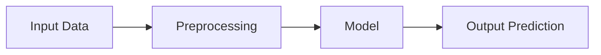

# 01 - Cos'è TensorFlow
> Fonte Notion: https://app.notion.com/p/3d612abc808d8154854ff0752a6c5b2c — ultima modifica 2026-09-15T09:49:20.474Z

> Giornata 1, sezioni 1–5 · video `TF-01`
**Allegati:** `day-01-appunti.pdf` (handout ufficiale)
---
## 1. Inquadramento del modulo `TF-01 @ 00:00:00`
Il docente si presenta e colloca il modulo dentro il percorso del master. Il modulo su TensorFlow è agganciato al corso del **professor Luciano Teresi**, *Neural Network in MATLAB*. Alla fine del percorso ci sarà un **assignment**, un piccolo progetto: si potrà scegliere fra quelli visti durante il corso oppure riprenderne uno dal corso di reti neurali in MATLAB. Il docente precisa di aver già concordato con il professor Teresi che il progetto sarà oggetto di valutazione, e che comunicherà eventuali cambiamenti.
---
## 2. Che cos'è TensorFlow `TF-01 @ 00:01:30`
TensorFlow è una libreria — ma la definizione più precisa è **framework**. La distinzione è sostanziale: quando si scrive codice in Python, TensorFlow non lo esegue riga per riga come farebbe l'interprete, ma **lo trasforma in un grafo** che va compilato. Il *core* di TensorFlow è infatti scritto in C++; Python, che è un linguaggio interpretato, viene usato soltanto come **interfaccia** verso quel core.
Dal documento introduttivo mostrato a schermo: TensorFlow è definito come libreria open-source per costruire e addestrare modelli di machine learning, adatta in particolare a modelli che coinvolgono grandi dataset e calcoli complessi, incluse le reti neurali profonde.
---
## 3. Tensori e grafo di dataflow `TF-01 @ 00:03:00`
Un **tensore** è, in prima approssimazione, un vettore a cui si aggiunge la dimensione dei canali.
TensorFlow rappresenta la struttura computazionale di un modello con un **grafo di dataflow**: i nodi del grafo sono operazioni, gli archi sono il flusso dei dati fra un'operazione e l'altra. Ogni nodo produce in uscita un tensore.
Il testo a schermo (`TF-01 @ 00:04:00`) descrive il dataflow come il modo in cui i dati si muovono attraverso un grafo diretto di nodi, dove i nodi sono le operazioni e gli archi il flusso dei dati fra un'operazione e l'altra.
**Diagramma mostrato a schermo:**

Il docente lo commenta come un grafo diretto: si parte dai dati di ingresso, che sono tensori; si applica il *preprocessing*, cioè le trasformazioni preliminari sui dati; si passa il risultato al modello; in uscita si ottiene un altro tensore.
<callout icon="➕">
	**Nota aggiunta — non trattata a lezione.** Il docente descrive il grafo di dataflow ma non nomina mai la *eager execution*, che pure compare a schermo in ogni output. TensorFlow 2 esegue le operazioni **immediatamente**, una per una, invece di costruire prima il grafo e mandarlo in esecuzione dopo: è per questo che ogni tensore stampa subito il proprio valore e `.numpy()` funziona sempre. Il grafo descritto qui resta il modello concettuale, e viene costruito davvero solo quando si compila un modello o si decora una funzione con `tf.function`. È anche la ragione per cui negli output si legge `<tf.Tensor: ...>` e nel traceback dell'errore su `assign` compare il tipo `EagerTensor`.
</callout>
---
## 4. I cinque passi per costruire un modello `TF-01 @ 00:05:00`
Gli appunti elencano i passi fondamentali sotto il titolo "How does tensorflow work". Il docente li commenta uno per uno.
**1. Definire il modello.** Dipende dal progetto e dal tipo di problema. Si definisce l'architettura: il numero e il tipo dei layer, la funzione di attivazione di ciascuno, e i parametri specifici del modello.
**2. Definire la funzione di perdita.** La *loss function* misura la performance del modello durante l'addestramento; l'obiettivo è **diminuirla**. Il meccanismo che lo consente è la *backpropagation*, che si appoggia alla **discesa del gradiente stocastica**.
**3. Definire l'ottimizzatore.** Serve ad aggiornare i parametri del modello durante l'addestramento. Il docente ne dà l'intuizione geometrica: si immagini il grafico della funzione di perdita; per arrivare al minimo si compie un piccolo passo alla volta. Il punto delicato è che i minimi possono essere molti — nei problemi di machine learning **trovare il minimo globale è difficile**, e in pratica si cerca un minimo che generalizzi bene sui dati. L'ottimizzatore decide come compiere quel passo.
**4. Definire il ciclo di addestramento.** Si itera sui dati in **batch**, calcolando loss e gradienti e applicando l'ottimizzatore. Nel ciclo si stabiliscono il numero di **epoche** e la **dimensione del batch**. Il docente aggiunge che TensorFlow permette di definire una variabile da sorvegliare, per **fermare il ciclo** al raggiungimento di un certo valore — il meccanismo dell'*early stopping*.
**5. Valutare il modello.** Si parte separando i dati in **addestramento** e **test**; i dati di test non devono partecipare all'addestramento. Alla fine si valuta il modello su di essi, ed è lì che si legge la performance reale, cioè quanto generalizza su dati nuovi.
---
## 5. Campi di applicazione `TF-01 @ 00:09:30`
Il docente scorre l'elenco delle applicazioni riportate negli appunti.
- **Regressione.** Quando la variabile in uscita è un **valore reale e continuo** — l'esempio è il prezzo di una casa. Per trattarla occorre che i dati stiano **nello stesso intervallo**: è la **normalizzazione**.
- **Clustering.** Algoritmo classico della statistica; nel machine learning si usa per categorizzare i dati assegnando loro una categoria.
- **Search engine.** Il riferimento è alle applicazioni tipo **RAG**: da una query testuale si cercano le parole e si estrae il contenuto da una base di dati. Serve un **embedding**, e TensorFlow può calcolarlo.
- **Translation.** Uno dei progetti tipici del *Natural Language Processing*.
- **Recommendation system.** Il docente precisa che è ormai **una libreria separata** da TensorFlow.
- **Giochi e apprendimento per rinforzo.** Dato un ambiente, l'agente impara a partire da un output che può essere una **reward**. L'esempio è gli scacchi: dato un pezzo esistono posizioni possibili, a ognuna si assegna un punteggio. TensorFlow serve a massimizzare la ricompensa complessiva.
- **Computer vision.** Affrontata storicamente con le **reti neurali convoluzionali**. Le applicazioni sono *image classification*, *image segmentation*, *object detection* — dal riconoscimento di oggetti in un'immagine fino alla guida autonoma.
